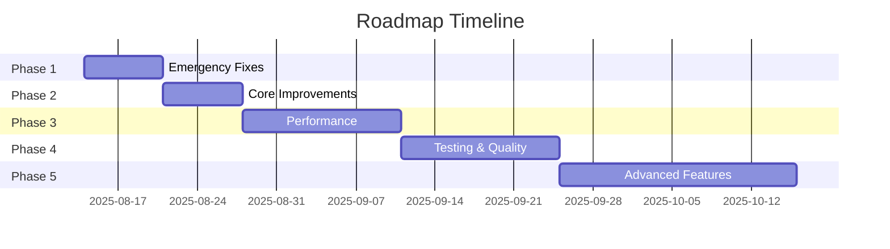

# 🚀 План оптимизации и исправлений AI Music Platform

**Версия плана:** 1.0.0  
**Дата создания:** 2025-08-14  
**Статус:** АКТИВЕН  
**Отслеживание:** Автоматизировано  

---

## 📊 Исполнительное резюме

План включает **78 задач** разделенных на **5 фаз** с общим временем выполнения **8-10 недель**.

### Приоритеты:
- 🔴 **CRITICAL** - Блокирующие проблемы (15 задач)
- 🟠 **HIGH** - Важные улучшения (25 задач)  
- 🟡 **MEDIUM** - Оптимизации (20 задач)
- 🟢 **LOW** - Nice-to-have (18 задач)

---

## 🎯 Фазы выполнения

### PHASE 1: Emergency Fixes (Неделя 1)
**Цель:** Устранить критические проблемы безопасности и функциональности

### PHASE 2: Core Improvements (Недели 2-3)
**Цель:** Улучшить качество кода и type safety

### PHASE 3: Performance Optimization (Недели 4-5)
**Цель:** Оптимизировать производительность и UX

### PHASE 4: Testing & Quality (Недели 6-7)
**Цель:** Внедрить тестирование и CI/CD

### PHASE 5: Advanced Features (Недели 8-10)
**Цель:** Добавить продвинутые возможности

---

## 📋 Детализированный план задач

### 🔴 PHASE 1: Emergency Fixes (Критические исправления)

#### Безопасность и зависимости

| ID | Задача | Приоритет | Зависимости | Время | Статус |
|----|--------|-----------|-------------|-------|--------|
| **SEC-001** | Исправить ESLint конфигурацию | 🔴 CRITICAL | - | 2h | ⏳ TODO |
| **SEC-002** | Откатить typescript-eslint до v7 | 🔴 CRITICAL | SEC-001 | 1h | ⏳ TODO |
| **SEC-003** | Устранить esbuild vulnerability | 🔴 CRITICAL | - | 2h | ⏳ TODO |
| **SEC-004** | Обновить Vite до latest | 🔴 CRITICAL | SEC-003 | 1h | ⏳ TODO |
| **SEC-005** | Аудит .env.local на production secrets | 🔴 CRITICAL | - | 1h | ⏳ TODO |
| **SEC-006** | Настроить security headers | 🟠 HIGH | - | 3h | ⏳ TODO |
| **SEC-007** | Внедрить CSP политики | 🟠 HIGH | SEC-006 | 2h | ⏳ TODO |

**Команды для выполнения:**
```bash
# SEC-001 & SEC-002
npm uninstall eslint typescript-eslint
npm install eslint@8.57.0 @typescript-eslint/eslint-plugin@7.18.0 @typescript-eslint/parser@7.18.0 --save-dev

# SEC-003 & SEC-004  
npm update vite@latest
npm audit fix --force
```

#### Конфигурация и настройки

| ID | Задача | Приоритет | Зависимости | Время | Статус |
|----|--------|-----------|-------------|-------|--------|
| **CFG-001** | Создать .eslintrc.json вместо flat config | 🔴 CRITICAL | SEC-002 | 1h | ⏳ TODO |
| **CFG-002** | Настроить pre-commit hooks | 🟠 HIGH | CFG-001 | 2h | ⏳ TODO |
| **CFG-003** | Добавить .nvmrc файл | 🟡 MEDIUM | - | 15m | ⏳ TODO |
| **CFG-004** | Создать .editorconfig | 🟢 LOW | - | 15m | ⏳ TODO |

**Файл .eslintrc.json:**
```json
{
  "root": true,
  "parser": "@typescript-eslint/parser",
  "plugins": ["@typescript-eslint", "react-hooks", "react-refresh"],
  "extends": [
    "eslint:recommended",
    "plugin:@typescript-eslint/recommended",
    "plugin:react-hooks/recommended"
  ],
  "rules": {
    "@typescript-eslint/no-unused-vars": "warn",
    "@typescript-eslint/no-explicit-any": "warn",
    "react-refresh/only-export-components": "warn"
  }
}
```

---

### 🟠 PHASE 2: Core Improvements (Основные улучшения)

#### TypeScript строгость

| ID | Задача | Приоритет | Зависимости | Время | Статус |
|----|--------|-----------|-------------|-------|--------|
| **TS-001** | Включить noImplicitAny | 🟠 HIGH | CFG-001 | 4h | ⏳ TODO |
| **TS-002** | Включить strictNullChecks | 🟠 HIGH | TS-001 | 6h | ⏳ TODO |
| **TS-003** | Исправить все any типы | 🟠 HIGH | TS-001 | 8h | ⏳ TODO |
| **TS-004** | Добавить типы для API responses | 🟠 HIGH | TS-003 | 4h | ⏳ TODO |
| **TS-005** | Типизировать Edge Functions | 🟠 HIGH | TS-004 | 6h | ⏳ TODO |
| **TS-006** | Включить strict mode для новых файлов | 🟡 MEDIUM | TS-002 | 2h | ⏳ TODO |

**План миграции TypeScript:**
```typescript
// tsconfig.json - поэтапное включение
{
  "compilerOptions": {
    // Phase 1
    "noImplicitAny": true,
    "noUnusedParameters": true,
    
    // Phase 2
    "strictNullChecks": true,
    "strictFunctionTypes": true,
    
    // Phase 3 (финальная)
    "strict": true
  }
}
```

#### Обновление зависимостей

| ID | Задача | Приоритет | Зависимости | Время | Статус |
|----|--------|-----------|-------------|-------|--------|
| **DEP-001** | Обновить @tanstack/react-query | 🟠 HIGH | - | 2h | ⏳ TODO |
| **DEP-002** | Обновить все @radix-ui пакеты | 🟠 HIGH | - | 3h | ⏳ TODO |
| **DEP-003** | Обновить Supabase до 2.55.0 | 🟠 HIGH | - | 2h | ⏳ TODO |
| **DEP-004** | Планировать major updates | 🟡 MEDIUM | DEP-001,DEP-002,DEP-003 | 4h | ⏳ TODO |
| **DEP-005** | Создать dependabot.yml | 🟡 MEDIUM | - | 1h | ⏳ TODO |

**Скрипт обновления:**
```bash
# Безопасные обновления
npm update @tanstack/react-query@^5.85.0
npm update @supabase/supabase-js@^2.55.0

# Radix UI batch update
npm update $(npm ls --json | jq -r '.dependencies | keys[] | select(startswith("@radix-ui"))')
```

---

### 🟡 PHASE 3: Performance Optimization (Оптимизация производительности)

#### Bundle оптимизация

| ID | Задача | Приоритет | Зависимости | Время | Статус |
|----|--------|-----------|-------------|-------|--------|
| **PERF-001** | Настроить bundle analyzer | 🟠 HIGH | - | 2h | ⏳ TODO |
| **PERF-002** | Внедрить code splitting | 🟠 HIGH | PERF-001 | 4h | ⏳ TODO |
| **PERF-003** | Lazy loading для routes | 🟠 HIGH | PERF-002 | 3h | ⏳ TODO |
| **PERF-004** | Tree shaking оптимизация | 🟡 MEDIUM | PERF-001 | 2h | ⏳ TODO |
| **PERF-005** | Минификация CSS | 🟡 MEDIUM | - | 1h | ⏳ TODO |
| **PERF-006** | Image optimization | 🟡 MEDIUM | - | 3h | ⏳ TODO |
| **PERF-007** | Service Worker для offline | 🟢 LOW | - | 4h | ⏳ TODO |

**Конфигурация Vite для оптимизации:**
```typescript
// vite.config.ts
export default defineConfig({
  build: {
    rollupOptions: {
      output: {
        manualChunks: {
          'vendor': ['react', 'react-dom', 'react-router-dom'],
          'ui': ['@radix-ui/react-dialog', '@radix-ui/react-dropdown-menu'],
          'supabase': ['@supabase/supabase-js'],
          'query': ['@tanstack/react-query']
        }
      }
    },
    chunkSizeWarningLimit: 1000
  }
})
```

#### Кеширование и данные

| ID | Задача | Приоритет | Зависимости | Время | Статус |
|----|--------|-----------|-------------|-------|--------|
| **CACHE-001** | Оптимизировать CacheManager | 🟠 HIGH | - | 3h | ⏳ TODO |
| **CACHE-002** | Внедрить compression для IndexedDB | 🟡 MEDIUM | CACHE-001 | 2h | ⏳ TODO |
| **CACHE-003** | Настроить cache invalidation стратегию | 🟠 HIGH | CACHE-001 | 3h | ⏳ TODO |
| **CACHE-004** | Добавить cache warming | 🟡 MEDIUM | CACHE-003 | 2h | ⏳ TODO |
| **CACHE-005** | Метрики cache hit rate | 🟢 LOW | CACHE-001 | 2h | ⏳ TODO |

---

### 🟢 PHASE 4: Testing & Quality (Тестирование и качество)

#### Настройка тестирования

| ID | Задача | Приоритет | Зависимости | Время | Статус |
|----|--------|-----------|-------------|-------|--------|
| **TEST-001** | Установить Vitest | 🟠 HIGH | - | 1h | ⏳ TODO |
| **TEST-002** | Настроить Testing Library | 🟠 HIGH | TEST-001 | 1h | ⏳ TODO |
| **TEST-003** | Написать unit тесты для hooks | 🟠 HIGH | TEST-002 | 8h | ⏳ TODO |
| **TEST-004** | Написать тесты для CacheManager | 🟠 HIGH | TEST-002 | 4h | ⏳ TODO |
| **TEST-005** | Integration тесты для API | 🟡 MEDIUM | TEST-002 | 6h | ⏳ TODO |
| **TEST-006** | E2E тесты с Playwright | 🟡 MEDIUM | TEST-002 | 8h | ⏳ TODO |
| **TEST-007** | Coverage reporting | 🟡 MEDIUM | TEST-003 | 2h | ⏳ TODO |

**Vitest конфигурация:**
```typescript
// vite.config.ts
export default defineConfig({
  test: {
    globals: true,
    environment: 'jsdom',
    setupFiles: './src/test/setup.ts',
    coverage: {
      reporter: ['text', 'json', 'html'],
      exclude: ['node_modules/', 'src/test/']
    }
  }
})
```

#### CI/CD Pipeline

| ID | Задача | Приоритет | Зависимости | Время | Статус |
|----|--------|-----------|-------------|-------|--------|
| **CI-001** | Настроить GitHub Actions | 🟠 HIGH | TEST-001 | 2h | ⏳ TODO |
| **CI-002** | Автоматический lint check | 🟠 HIGH | CI-001, CFG-001 | 1h | ⏳ TODO |
| **CI-003** | Автоматические тесты | 🟠 HIGH | CI-001, TEST-003 | 1h | ⏳ TODO |
| **CI-004** | Security audit в CI | 🟠 HIGH | CI-001 | 1h | ⏳ TODO |
| **CI-005** | Автоматический deploy | 🟡 MEDIUM | CI-003 | 3h | ⏳ TODO |
| **CI-006** | Performance monitoring | 🟢 LOW | CI-001 | 2h | ⏳ TODO |

**GitHub Actions workflow:**
```yaml
# .github/workflows/ci.yml
name: CI Pipeline

on:
  push:
    branches: [main, develop]
  pull_request:
    branches: [main]

jobs:
  quality:
    runs-on: ubuntu-latest
    steps:
      - uses: actions/checkout@v3
      - uses: actions/setup-node@v3
        with:
          node-version: '20'
      
      - name: Install dependencies
        run: npm ci
      
      - name: Lint
        run: npm run lint
      
      - name: Type check
        run: npx tsc --noEmit
      
      - name: Test
        run: npm test
      
      - name: Security audit
        run: npm audit --audit-level=moderate
```

---

### 🚀 PHASE 5: Advanced Features (Продвинутые возможности)

#### Мониторинг и аналитика

| ID | Задача | Приоритет | Зависимости | Время | Статус |
|----|--------|-----------|-------------|-------|--------|
| **MON-001** | Внедрить Sentry для ошибок | 🟠 HIGH | - | 3h | ⏳ TODO |
| **MON-002** | Настроить performance monitoring | 🟡 MEDIUM | MON-001 | 2h | ⏳ TODO |
| **MON-003** | User analytics (Mixpanel/Posthog) | 🟡 MEDIUM | - | 4h | ⏳ TODO |
| **MON-004** | Custom metrics dashboard | 🟢 LOW | MON-002 | 6h | ⏳ TODO |
| **MON-005** | Real-time alerting | 🟢 LOW | MON-001 | 3h | ⏳ TODO |

#### AI оптимизации

| ID | Задача | Приоритет | Зависимости | Время | Статус |
|----|--------|-----------|-------------|-------|--------|
| **AI-001** | Rate limiting optimization | 🟠 HIGH | - | 3h | ⏳ TODO |
| **AI-002** | AI response caching | 🟠 HIGH | CACHE-001 | 4h | ⏳ TODO |
| **AI-003** | Retry logic для AI calls | 🟠 HIGH | - | 3h | ⏳ TODO |
| **AI-004** | Cost optimization система | 🟡 MEDIUM | AI-002 | 4h | ⏳ TODO |
| **AI-005** | Quality scoring для генераций | 🟡 MEDIUM | - | 6h | ⏳ TODO |
| **AI-006** | A/B testing для промптов | 🟢 LOW | AI-005 | 8h | ⏳ TODO |

#### Developer Experience

| ID | Задача | Приоритет | Зависимости | Время | Статус |
|----|--------|-----------|-------------|-------|--------|
| **DX-001** | Storybook для компонентов | 🟡 MEDIUM | - | 4h | ⏳ TODO |
| **DX-002** | API документация (OpenAPI) | 🟡 MEDIUM | - | 6h | ⏳ TODO |
| **DX-003** | Component library docs | 🟢 LOW | DX-001 | 4h | ⏳ TODO |
| **DX-004** | Development seeds/fixtures | 🟢 LOW | - | 3h | ⏳ TODO |
| **DX-005** | Docker dev environment | 🟢 LOW | - | 4h | ⏳ TODO |

---

## 📈 Метрики успеха

### Ключевые показатели (KPIs)

| Метрика | Текущее | Целевое | Срок |
|---------|---------|---------|------|
| **TypeScript coverage** | 60% | 95% | 4 недели |
| **Test coverage** | 0% | 80% | 6 недель |
| **Bundle size** | ~2MB | <1MB | 5 недель |
| **Lighthouse score** | 75 | 95+ | 6 недель |
| **Security vulnerabilities** | 3 | 0 | 1 неделя |
| **ESLint errors** | Broken | 0 | 1 неделя |
| **Cache hit rate** | 70% | 90% | 4 недели |
| **Build time** | 45s | <20s | 3 недели |

### Прогресс по фазам



---

## 🔄 Процесс выполнения

### Daily Workflow

1. **Morning Standup (9:00)**
   - Проверка прогресса по текущим задачам
   - Обновление статусов в трекере
   - Выявление блокеров

2. **Development (9:30-17:00)**
   - Работа по приоритетным задачам
   - Code review для завершенных задач
   - Обновление документации

3. **Evening Review (17:00)**
   - Коммит изменений
   - Обновление CHANGELOG
   - Планирование на следующий день

### Weekly Milestones

| Неделя | Milestone | Ожидаемые результаты |
|--------|-----------|---------------------|
| **1** | Security Fixed | ESLint работает, 0 vulnerabilities |
| **2** | TypeScript Strict | noImplicitAny включен |
| **3** | Dependencies Updated | Все critical updates применены |
| **4** | Performance Boost | Bundle <1.5MB, code splitting |
| **5** | Cache Optimized | 85% hit rate |
| **6** | Testing Setup | 50% coverage |
| **7** | CI/CD Running | Автоматизация работает |
| **8** | Monitoring Active | Sentry + metrics |
| **9** | AI Optimized | Cost reduction 30% |
| **10** | Production Ready | Все KPIs достигнуты |

---

## 🛠️ Инструменты и ресурсы

### Необходимые инструменты

```bash
# Установить глобально
npm install -g npm-check-updates
npm install -g bundle-buddy
npm install -g source-map-explorer

# Dev dependencies
npm install --save-dev \
  vitest \
  @testing-library/react \
  @testing-library/jest-dom \
  @testing-library/user-event \
  @vitest/ui \
  @vitest/coverage-v8 \
  husky \
  lint-staged \
  prettier
```

### Полезные скрипты

```json
// package.json scripts
{
  "scripts": {
    "analyze": "source-map-explorer 'dist/**/*.js'",
    "bundle-report": "vite build --mode analyze",
    "test": "vitest",
    "test:ui": "vitest --ui",
    "test:coverage": "vitest run --coverage",
    "lint:fix": "eslint . --fix",
    "format": "prettier --write .",
    "typecheck": "tsc --noEmit",
    "security": "npm audit --audit-level=moderate",
    "deps:check": "ncu",
    "deps:update": "ncu -u && npm install"
  }
}
```

---

## 📊 Трекинг прогресса

### Статус задач

- ⏳ **TODO**: 78 задач
- 🚧 **IN PROGRESS**: 0 задач
- ✅ **COMPLETED**: 0 задач
- ❌ **BLOCKED**: 0 задач

### Прогресс по приоритетам

- 🔴 **CRITICAL**: 0/15 (0%)
- 🟠 **HIGH**: 0/25 (0%)
- 🟡 **MEDIUM**: 0/20 (0%)
- 🟢 **LOW**: 0/18 (0%)

**Общий прогресс: 0/78 (0%)**

---

## 🔄 Автоматизация отслеживания

### GitHub Project Board

Создать GitHub Project со следующими колонками:
- **Backlog** - все задачи из плана
- **Ready** - задачи готовые к выполнению
- **In Progress** - текущие задачи
- **Review** - на code review
- **Done** - завершенные

### Автоматические проверки

```yaml
# .github/workflows/progress.yml
name: Progress Tracker

on:
  schedule:
    - cron: '0 9 * * *' # Daily at 9 AM
  workflow_dispatch:

jobs:
  track:
    runs-on: ubuntu-latest
    steps:
      - name: Check task progress
        run: |
          # Скрипт для проверки прогресса
          # и отправки уведомлений
```

---

## 📝 Changelog Template

```markdown
## [Version] - Date

### 🔴 Critical Fixes
- [ID] Description

### 🟠 High Priority
- [ID] Description

### 🟡 Medium Priority
- [ID] Description

### 🟢 Low Priority
- [ID] Description

### 📊 Metrics
- TypeScript coverage: X%
- Test coverage: X%
- Bundle size: XMB
- Vulnerabilities: X
```

---

## ✅ Контрольный чек-лист

### Pre-commit checklist
- [ ] ESLint прошел без ошибок
- [ ] TypeScript компилируется
- [ ] Тесты проходят
- [ ] Нет новых vulnerabilities
- [ ] Bundle size не увеличился
- [ ] Документация обновлена

### Pre-release checklist
- [ ] Все CRITICAL задачи завершены
- [ ] Test coverage >60%
- [ ] Performance metrics в норме
- [ ] Security audit чистый
- [ ] CHANGELOG обновлен
- [ ] Version bumped

---

*План создан: 2025-08-14*  
*Последнее обновление: 2025-08-14*  
*Версия плана: 1.0.0*