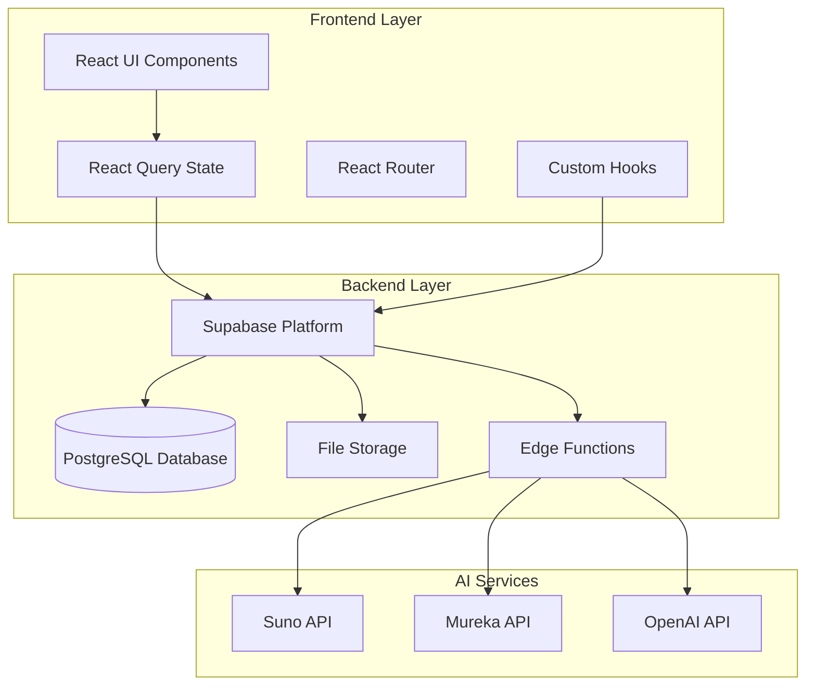
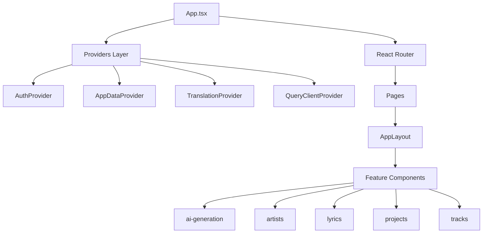
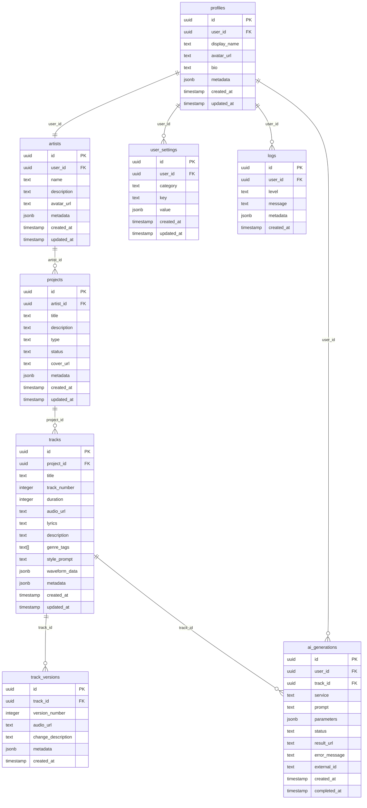
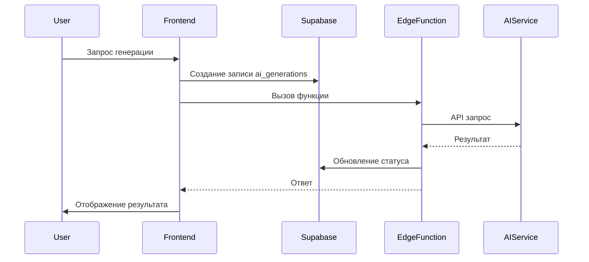

# 🎵 AI Tune Creator - Карта Проекта

> Детальный анализ архитектуры и зависимостей платформы для создания музыки с ИИ

## 📋 Обзор Проекта

**AI Tune Creator** — современная веб-платформа для создания, управления и коллаборации в области музыкального производства с использованием технологий искусственного интеллекта.

### 🎯 Ключевые Характеристики
- **Тип**: Single Page Application (SPA)
- **Архитектура**: Feature-based модульная архитектура
- **Стек**: React + TypeScript + Supabase
- **Версия**: 0.1.33
- **Репозиторий**: https://github.com/HOW2AI-AGENCY/ai-tune-creator

## 🏗️ Архитектура Системы

### Общая Архитектура



### Frontend Архитектура



## 📦 Структура Проекта

### Основные Директории

```
ai-tune-creator/
├── src/
│   ├── components/          # UI компоненты
│   │   ├── auth/           # Компоненты аутентификации
│   │   ├── layout/         # Компоненты макета
│   │   └── ui/             # shadcn/ui компоненты
│   ├── features/           # Функциональные модули
│   │   ├── ai-generation/  # ИИ генерация музыки
│   │   ├── artists/        # Управление артистами
│   │   ├── lyrics/         # Редактор лирики
│   │   ├── projects/       # Управление проектами
│   │   └── tracks/         # Управление треками
│   ├── hooks/              # Пользовательские хуки
│   │   └── data/           # Хуки для работы с данными
│   ├── integrations/       # Внешние интеграции
│   │   └── supabase/       # Supabase клиент
│   ├── lib/                # Утилиты и хелперы
│   ├── pages/              # Страницы приложения
│   └── providers/          # React провайдеры
├── supabase/
│   ├── functions/          # Edge Functions
│   └── migrations/         # Миграции БД
└── docs/                   # Документация
```

## 🗄️ Схема Базы Данных

### Основные Таблицы



### Безопасность (RLS)

Все таблицы защищены Row Level Security (RLS) политиками:
- Пользователи видят только свои данные
- Каскадное удаление при удалении пользователя
- Проверка прав доступа на уровне БД

## 🔌 AI Интеграции

### Edge Functions

| Функция | Назначение | AI Сервис |
|---------|------------|----------|
| `analyze-lyrics` | Анализ структуры лирики | OpenAI |
| `analyze-reference` | Анализ референсных треков | OpenAI |
| `generate-artist-info` | Генерация информации об артисте | OpenAI |
| `generate-cover-image` | Создание обложек | OpenAI DALL-E |
| `generate-mureka-track` | Генерация через Mureka | Mureka API |
| `generate-project-concept` | Концепция проекта | OpenAI |
| `generate-style-prompt` | Стилевые промпты | OpenAI |
| `generate-suno-track` | Генерация через Suno | Suno API |
| `generate-track-concept` | Концепция трека | OpenAI |
| `generate-track-lyrics` | Генерация лирики | OpenAI |
| `improve-lyrics` | Улучшение лирики | OpenAI |

### Поток AI Генерации



## 📱 Features (Функциональные Модули)

### 1. AI Generation
**Путь**: `src/features/ai-generation/`

**Компоненты**:
- `FloatingPlayer` - Плавающий аудиоплеер
- `GenerationFeed` - Лента генераций
- `GenerationSidebar` - Боковая панель
- `LyricsDrawer` - Выдвижная панель лирики
- `TrackGenerationSidebar` - Панель генерации треков

**Хуки**:
- `useImageGeneration` - Генерация изображений
- `useTrackGeneration` - Генерация треков
- `useTrackGenerationWithRetry` - Генерация с повторами

### 2. Artists
**Путь**: `src/features/artists/`

**Компоненты**:
- `ArtistBannerUploadDialog` - Загрузка баннеров
- `ArtistDetailsDialog` - Детали артиста
- `CreateArtistDialog` - Создание артиста

### 3. Lyrics
**Путь**: `src/features/lyrics/`

**Компоненты**:
- `LyricsEditor` - Редактор лирики
- `LyricsExportDialog` - Экспорт лирики
- `LyricsMetrics` - Метрики лирики
- `LyricsStructurePanel` - Панель структуры
- `LyricsToolbar` - Панель инструментов
- `LyricsViewer` - Просмотрщик лирики
- `LyricsVirtualizedViewer` - Виртуализированный просмотр

**Хуки**:
- `useLyricsAutoSave` - Автосохранение
- `useLyricsParser` - Парсинг лирики

**Утилиты**:
- `lyricsUtils` - Утилиты для работы с лирикой

### 4. Projects
**Путь**: `src/features/projects/`

**Компоненты**:
- `BannerUploadDialog` - Загрузка баннеров
- `CoverUploadDialog` - Загрузка обложек
- `CreateProjectDialog` - Создание проекта
- `CreateProjectWithAIDialog` - Создание с ИИ
- `ProjectDetailsDialog` - Детали проекта
- `ProjectNotesDialog` - Заметки проекта

### 5. Tracks
**Путь**: `src/features/tracks/`

**Компоненты**:
- `CreateTrackDialog` - Создание трека
- `LyricsAnalysisReport` - Отчет анализа лирики
- `TrackDetailsDialog` - Детали трека
- `TrackEditDialog` - Редактирование трека
- `TrackGenerationDialog` - Генерация трека
- `TrackVersionsDialog` - Версии трека
- `TrackViewDialog` - Просмотр трека

## 🔗 Зависимости

### Основные Зависимости

| Пакет | Версия | Назначение |
|-------|--------|------------|
| `react` | ^18.3.1 | UI библиотека |
| `typescript` | ^5.5.3 | Типизация |
| `vite` | ^5.4.1 | Сборщик |
| `@supabase/supabase-js` | ^2.53.0 | Backend клиент |
| `@tanstack/react-query` | ^5.56.2 | Управление состоянием |
| `react-router-dom` | ^6.26.2 | Маршрутизация |
| `tailwindcss` | ^3.4.11 | CSS фреймворк |
| `zod` | ^3.23.8 | Валидация схем |

### UI Компоненты (Radix UI)

- `@radix-ui/react-dialog` - Модальные окна
- `@radix-ui/react-dropdown-menu` - Выпадающие меню
- `@radix-ui/react-tabs` - Вкладки
- `@radix-ui/react-toast` - Уведомления
- `@radix-ui/react-tooltip` - Подсказки
- И множество других компонентов

### Дополнительные Библиотеки

- `lucide-react` - Иконки
- `date-fns` - Работа с датами
- `react-hook-form` - Формы
- `recharts` - Графики
- `embla-carousel-react` - Карусели
- `idb` - IndexedDB
- `cmdk` - Command palette

## 🗂️ Файловое Хранилище

### Storage Buckets

| Bucket | Назначение | Политики |
|--------|------------|----------|
| `avatars` | Аватары пользователей | Публичное чтение, аутентифицированная запись |
| `artist-assets` | Медиафайлы артистов | Публичное чтение, аутентифицированная запись |

### Типы Файлов

- **Изображения**: PNG, JPG, WebP
- **Аудио**: MP3, WAV, FLAC
- **Документы**: PDF, TXT

## 🔧 Конфигурация

### TypeScript

```json
{
  "baseUrl": ".",
  "paths": {
    "@/*": ["./src/*"]
  },
  "noImplicitAny": false,
  "skipLibCheck": true,
  "allowJs": true
}
```

### Vite

- React SWC плагин для быстрой компиляции
- Алиасы путей для удобного импорта
- Оптимизация для production

### ESLint

- React hooks правила
- TypeScript интеграция
- Автоматическое форматирование

## 📊 Производительность

### React Query Оптимизации

- **Stale Time**: 5 минут
- **Cache Time**: 30 минут
- **Refetch on Focus**: Отключено
- **Retry**: 2 попытки с экспоненциальной задержкой

### Кеширование

- Агрессивное кеширование запросов
- Intelligent invalidation
- Оптимизация для минимального количества запросов к БД

## 🚀 Развертывание

### Скрипты

```json
{
  "dev": "vite",
  "build": "vite build",
  "build:dev": "vite build --mode development",
  "lint": "eslint .",
  "preview": "vite preview"
}
```

### Переменные Окружения

- `VITE_SUPABASE_URL` - URL Supabase проекта
- `VITE_SUPABASE_ANON_KEY` - Публичный ключ Supabase
- AI API ключи для Edge Functions

## 📈 Метрики и Аналитика

### Отслеживаемые События

- Создание артистов, проектов, треков
- AI генерации (успешные/неудачные)
- Загрузка файлов
- Редактирование лирики
- Экспорт данных

### Логирование

- Системные логи в таблице `logs`
- Уровни: ERROR, WARN, INFO, DEBUG
- Метаданные для детального анализа

## 🔮 Планы Развития

### Ближайшие Задачи

- [ ] Улучшение UI/UX
- [ ] Добавление новых AI сервисов
- [ ] Оптимизация производительности
- [ ] Расширение аналитики
- [ ] Мобильная версия

### Долгосрочные Цели

- [ ] Коллаборативное редактирование
- [ ] Интеграция с музыкальными платформами
- [ ] Расширенная аналитика треков
- [ ] Marketplace для AI моделей
- [ ] API для сторонних разработчиков

---

*Документ создан автоматически на основе анализа кодовой базы AI Tune Creator*
*Последнее обновление: 2024*