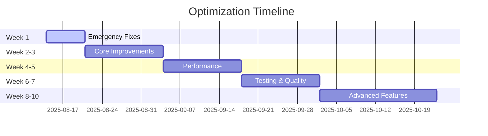

# 📊 Dashboard задач оптимизации AI Music Platform

**Последнее обновление:** 2025-08-14  
**Версия:** 1.0.0  
**Автообновление:** Каждые 24 часа  

---

## 🎯 Текущий фокус

### 🔴 PHASE 1: Emergency Fixes
**Статус:** ⏳ ОЖИДАЕТ НАЧАЛА  
**Прогресс:** 0/7 задач (0%)  
**Deadline:** Конец недели 1  

#### Активные задачи:
```
[ ] SEC-001 - Исправить ESLint конфигурацию (2h)
[ ] SEC-002 - Откатить typescript-eslint до v7 (1h)  
[ ] SEC-003 - Устранить esbuild vulnerability (2h)
```

---

## 📈 Общий прогресс

```
Общий прогресс:     [░░░░░░░░░░░░░░░░░░░░░░░░░░░░░░] 0%
Критические задачи: [░░░░░░░░░░░░░░░░░░░░░░░░░░░░░░] 0/15
Высокий приоритет:  [░░░░░░░░░░░░░░░░░░░░░░░░░░░░░░] 0/25
Средний приоритет:  [░░░░░░░░░░░░░░░░░░░░░░░░░░░░░░] 0/20
Низкий приоритет:   [░░░░░░░░░░░░░░░░░░░░░░░░░░░░░░] 0/18
```

### 📊 Статистика
- **Всего задач:** 78
- **Завершено:** 0 (0%)
- **В процессе:** 0
- **Ожидает:** 78
- **Заблокировано:** 0

---

## 🚀 Быстрые команды

### Начать работу над задачей:
```bash
# Выбрать первую критическую задачу
npm run task:start SEC-001

# Или использовать tracker
node scripts/progress-tracker.js update SEC-001 "🚧 IN PROGRESS"
```

### Завершить задачу:
```bash
# Отметить как выполненную
npm run task:complete SEC-001

# Или через tracker
node scripts/progress-tracker.js update SEC-001 "✅ COMPLETED"
```

### Проверить статус:
```bash
# Показать текущий статус
node scripts/progress-tracker.js status

# Генерировать отчет
node scripts/progress-tracker.js report

# Показать метрики
node scripts/progress-tracker.js metrics
```

---

## 📋 Фазы выполнения

### PHASE 1: Emergency Fixes (Неделя 1)
```
┌─────────────────────────────────────────────┐
│ ID       │ Задача                   │ Статус │
├─────────────────────────────────────────────┤
│ SEC-001  │ Fix ESLint              │ ⏳ TODO │
│ SEC-002  │ Rollback TS-ESLint      │ ⏳ TODO │
│ SEC-003  │ Fix esbuild vuln        │ ⏳ TODO │
│ SEC-004  │ Update Vite             │ ⏳ TODO │
│ SEC-005  │ Audit .env.local        │ ⏳ TODO │
│ SEC-006  │ Security headers        │ ⏳ TODO │
│ SEC-007  │ CSP policies            │ ⏳ TODO │
└─────────────────────────────────────────────┘
```

### PHASE 2: Core Improvements (Недели 2-3)
```
┌─────────────────────────────────────────────┐
│ ID       │ Задача                   │ Статус │
├─────────────────────────────────────────────┤
│ TS-001   │ Enable noImplicitAny    │ ⏳ TODO │
│ TS-002   │ Enable strictNullChecks │ ⏳ TODO │
│ TS-003   │ Fix all any types       │ ⏳ TODO │
│ DEP-001  │ Update React Query      │ ⏳ TODO │
│ DEP-002  │ Update Radix UI         │ ⏳ TODO │
└─────────────────────────────────────────────┘
```

### PHASE 3: Performance (Недели 4-5)
```
┌─────────────────────────────────────────────┐
│ ID       │ Задача                   │ Статус │
├─────────────────────────────────────────────┤
│ PERF-001 │ Bundle analyzer         │ ⏳ TODO │
│ PERF-002 │ Code splitting          │ ⏳ TODO │
│ PERF-003 │ Lazy loading            │ ⏳ TODO │
│ CACHE-001│ Optimize CacheManager   │ ⏳ TODO │
└─────────────────────────────────────────────┘
```

### PHASE 4: Testing (Недели 6-7)
```
┌─────────────────────────────────────────────┐
│ ID       │ Задача                   │ Статус │
├─────────────────────────────────────────────┤
│ TEST-001 │ Setup Vitest            │ ⏳ TODO │
│ TEST-002 │ Testing Library         │ ⏳ TODO │
│ TEST-003 │ Unit tests for hooks    │ ⏳ TODO │
│ CI-001   │ GitHub Actions          │ ⏳ TODO │
└─────────────────────────────────────────────┘
```

### PHASE 5: Advanced (Недели 8-10)
```
┌─────────────────────────────────────────────┐
│ ID       │ Задача                   │ Статус │
├─────────────────────────────────────────────┤
│ MON-001  │ Sentry integration      │ ⏳ TODO │
│ AI-001   │ Rate limit optimization │ ⏳ TODO │
│ AI-002   │ AI response caching     │ ⏳ TODO │
│ DX-001   │ Storybook setup         │ ⏳ TODO │
└─────────────────────────────────────────────┘
```

---

## 🏆 Ключевые метрики (KPIs)

| Метрика | Текущее | Цель | Прогресс |
|---------|---------|------|----------|
| **TypeScript coverage** | 60% | 95% | 🔴 |
| **Test coverage** | 0% | 80% | 🔴 |
| **Bundle size** | 2MB | <1MB | 🔴 |
| **Lighthouse score** | 75 | 95+ | 🟡 |
| **Security vulns** | 3 | 0 | 🔴 |
| **ESLint status** | ❌ | ✅ | 🔴 |
| **Cache hit rate** | 70% | 90% | 🟡 |
| **Build time** | 45s | <20s | 🟡 |

---

## 📅 Timeline & Milestones



### 🎯 Недельные цели

| Неделя | Цель | Критерий успеха |
|--------|------|-----------------|
| **1** | Security Fixed | ESLint работает, 0 vulns |
| **2** | TypeScript Strict P1 | noImplicitAny включен |
| **3** | Dependencies Updated | Все critical обновлены |
| **4** | Performance P1 | Bundle <1.5MB |
| **5** | Cache Optimized | 85% hit rate |
| **6** | Testing Setup | 50% coverage |
| **7** | CI/CD Running | Автоматизация работает |
| **8** | Monitoring Active | Sentry интегрирован |
| **9** | AI Optimized | Cost -30% |
| **10** | Production Ready | Все KPIs достигнуты |

---

## 🔄 Daily Workflow

### 🌅 Утро (9:00)
```bash
# Проверить статус
node scripts/progress-tracker.js status

# Выбрать задачу на день
npm run task:select
```

### 🏗️ День (9:30-17:00)
```bash
# Работа над задачей
npm run dev

# Проверка изменений
npm run lint:fix
npm run typecheck
```

### 🌆 Вечер (17:00)
```bash
# Коммит изменений
git add .
git commit -m "[TASK-ID] Description"

# Обновить статус
node scripts/progress-tracker.js update TASK-ID "✅ COMPLETED"

# Генерировать отчет
node scripts/progress-tracker.js report
```

---

## 📝 Последние обновления

### 2025-08-14
- ✅ Создан план оптимизации (OPTIMIZATION_ROADMAP.md)
- ✅ Обновлен CLAUDE.md с инструкциями
- ✅ Настроена система мониторинга (progress-tracker.js)
- ✅ Создан dashboard для отслеживания

### Следующие шаги:
1. Начать с задачи SEC-001 (Fix ESLint)
2. Установить необходимые зависимости
3. Запустить первый цикл оптимизации

---

## 🛠️ Полезные ссылки

- [План оптимизации](./OPTIMIZATION_ROADMAP.md)
- [Аудит проекта](./FINAL_AUDIT_REPORT.md)
- [Инструкции Claude](./CLAUDE.md)
- [Progress Tracker](./scripts/progress-tracker.js)

---

## 💡 Quick Tips

### Проверка зависимостей задачи:
```bash
grep "SEC-001" OPTIMIZATION_ROADMAP.md
```

### Быстрый фикс ESLint:
```bash
npm uninstall eslint typescript-eslint
npm install eslint@8.57.0 @typescript-eslint/eslint-plugin@7.18.0 --save-dev
```

### Проверка уязвимостей:
```bash
npm audit --audit-level=moderate
```

### Анализ bundle:
```bash
npm run build -- --mode analyze
```

---

*Dashboard обновляется автоматически при изменении статуса задач*  
*Используйте `node scripts/progress-tracker.js` для управления*