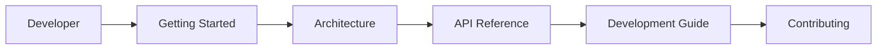
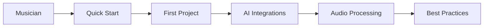
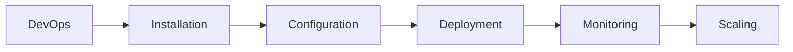

# 📚 AI Tune Creator - Документация

Добро пожаловать в комплексную документацию AI Tune Creator - современной платформы для создания музыки с помощью искусственного интеллекта.

**Статус проекта**: 🟢 АКТИВНАЯ РАЗРАБОТКА | **Версия**: 0.1.33 | **Последний аудит**: 21.08.2025

## 📋 Содержание

### 🚀 Getting Started
- **[Quick Start Guide](./getting-started.md)** - Get up and running in 5 minutes
- **[AI Generation System Guide](./ai-generation-system-guide.md)** - Complete guide to AI music generation
- **[Troubleshooting](./troubleshooting.md)** - Common issues and solutions
- **[Installation](./installation.md)** - Detailed installation instructions
- **[Configuration](./configuration.md)** - Environment setup and configuration
- **[First Project](./first-project.md)** - Create your first AI-generated music

### 🏗️ Architecture
- **[System Architecture](./architecture.md)** - High-level system design
- **[Database Schema](./database/schema.md)** - Complete database documentation
- **[API Design](./api/README.md)** - RESTful API architecture
- **[Security Model](./security/README.md)** - Authentication and authorization

### 🤖 AI Integrations
- **[Overview](./integrations/README.md)** - AI services integration guide
- **[Suno API](./integrations/suno.md)** - Text-to-music generation
- **[Mureka AI](./integrations/mureka.md)** - Advanced AI models
- **[Udio AI](./integrations/udio.md)** - Professional audio generation
- **[ElevenLabs](./integrations/elevenlabs.md)** - Voice synthesis
- **[Auphonic](./integrations/auphonic.md)** - Audio enhancement
- **[LANDR](./integrations/landr.md)** - AI mastering

### 🎛️ Audio Processing
- **[Overview](./audio-processing/README.md)** - Professional audio tools
- **[Formats & Quality](./audio-processing/formats.md)** - Supported formats
- **[DAW Integration](./audio-processing/daw-integration.md)** - Digital Audio Workstation
- **[Mastering Pipeline](./audio-processing/mastering.md)** - Automated mastering
- **[Batch Processing](./audio-processing/batch.md)** - Processing multiple files

### 🔧 Development
- **[Developer Guide](./development/README.md)** - Development environment setup
- **[Contributing](./development/contributing.md)** - How to contribute
- **[Testing](./development/testing.md)** - Testing strategies
- **[Debugging](./development/debugging.md)** - Debugging tools and techniques

### 🚀 Deployment
- **[Production Deployment](./deployment/README.md)** - Production setup
- **[Environment Configuration](./deployment/environment.md)** - Environment variables
- **[Monitoring](./deployment/monitoring.md)** - Performance monitoring
- **[Scaling](./deployment/scaling.md)** - Horizontal and vertical scaling

### 📖 API Reference
- **[Authentication](./api/authentication.md)** - API authentication
- **[Projects API](./api/projects.md)** - Project management endpoints
- **[Tracks API](./api/tracks.md)** - Track management endpoints
- **[AI Generation API](./api/ai-generation.md)** - AI generation endpoints
- **[Audio Processing API](./api/audio-processing.md)** - Audio processing endpoints

### 🛠️ Tools & Utilities
- **[CLI Tools](./tools/cli.md)** - Command-line interface
- **[SDK Libraries](./tools/sdk.md)** - Software development kits
- **[Browser Extensions](./tools/extensions.md)** - Browser integrations
- **[Mobile Apps](./tools/mobile.md)** - Mobile applications

## 🔍 Quick Navigation

### For Developers

### For Musicians

### For DevOps

## 🆘 Need Help?

- **🐛 Bug Reports**: [GitHub Issues](https://github.com/yourusername/ai-music-platform/issues)
- **💡 Feature Requests**: [GitHub Discussions](https://github.com/yourusername/ai-music-platform/discussions)
- **💬 Community**: [Discord Server](https://discord.gg/ai-music)
- **📧 Support**: support@ai-music-platform.com

## 📚 External Resources

- **[Supabase Documentation](https://supabase.io/docs)**
- **[React Documentation](https://reactjs.org/docs)**
- **[TypeScript Handbook](https://www.typescriptlang.org/docs)**
- **[Tailwind CSS](https://tailwindcss.com/docs)**

## 🔄 Documentation Updates

This documentation is continuously updated. Last updated: **January 2025**

---

**[🏠 Back to Main README](../README.md)** • **[🚀 Get Started](./getting-started.md)** • **[📖 API Docs](./api/README.md)**

