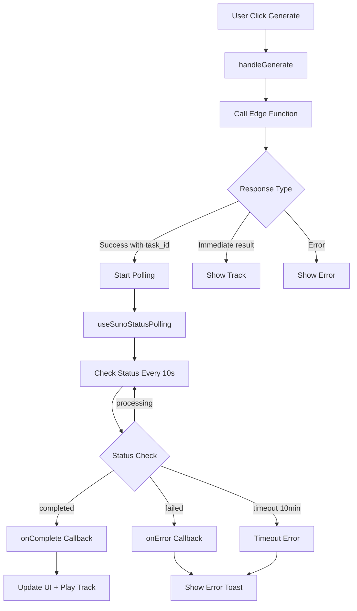

# 🎵 Анализ системы AI генерации музыки

## 📊 Общий обзор системы

Система AI генерации музыки в AI-Tune-Creator представляет собой полнофункциональную платформу для создания музыкальных треков с использованием различных AI-сервисов (Suno AI и Mureka). Система построена на современной архитектуре с асинхронной обработкой, real-time мониторингом и интуитивным пользовательским интерфейсом.

---

## 🎯 1. АНАЛИЗ ИНТЕРФЕЙСА СИСТЕМЫ

### 1.1 Архитектура интерфейса
**Файлы:** `AIGenerationNew.tsx`, `TrackGenerationSidebar.tsx`, `FloatingPlayer.tsx`, `LyricsDrawer.tsx`

**Ключевые особенности:**
- **Двухколоночный layout** - sidebar для генерации + основная область с результатами
- **Card-based grid** - современное отображение треков в стиле музыкальных стриминговых сервисов
- **Модальные компоненты** - FloatingPlayer и LyricsDrawer для детального просмотра

### 1.2 TrackGenerationSidebar (Боковая панель генерации)
```typescript
// src/features/ai-generation/components/TrackGenerationSidebar.tsx:32-37
interface TrackGenerationSidebarProps {
  projects: Option[];
  artists: Option[];
  onGenerate: (params: GenerationParams) => void;
  isGenerating: boolean;
}
```

**Функциональность:**
- ✅ **Контекстный выбор** - проект, артист (с опцией "Без проекта/артиста")
- ✅ **Стилевые настройки** - жанр, настроение, AI сервис
- ✅ **Описание трека** - детальный prompt для генерации
- ✅ **Валидация форм** - проверка заполненности полей
- ✅ **Visual feedback** - анимации загрузки, disabled состояния

### 1.3 Основная область контента (Grid View)
**Ключевые компоненты:**
- **Поисковая строка** - фильтрация по названию и описанию
- **Статистика** - badge с количеством треков
- **Grid layout** - адаптивная сетка (2-5 колонок в зависимости от экрана)
- **Hover effects** - интерактивные overlay с кнопками управления

### 1.4 Track Card Interface
```typescript
// src/pages/AIGenerationNew.tsx:501-562
<Card className="bg-card border-border hover:bg-accent/10 transition-all cursor-pointer group hover:scale-105">
  {/* Cover Image с градиентом */}
  {/* Hover Controls - Play, Like, Download */}
  {/* Duration & Views badges */}
  {/* Track Info - название, артист, проект */}
  {/* Service & Genre badges */}
</Card>
```

**UX особенности:**
- ✅ **Hover interactions** - кнопки появляются при наведении
- ✅ **Visual hierarchy** - четкое разделение информации
- ✅ **Status indicators** - badges для сервиса, жанра, избранного
- ✅ **Progressive enhancement** - graceful degradation без JavaScript

---

## 📊 2. СИСТЕМА МОНИТОРИНГА ПРОГРЕССА

### 2.1 Архитектура polling системы
**Файл:** `useSunoStatusPolling.tsx`

```typescript
// src/features/ai-generation/hooks/useSunoStatusPolling.tsx:23-28
export function useSunoStatusPolling({ 
  taskId, 
  enabled = true, 
  onComplete, 
  onError 
}: UseSunoStatusPollingProps)
```

### 2.2 Lifecycle генерации трека



### 2.3 Polling механизм
**Конфигурация:**
- ✅ **Интервал polling** - 10 секунд (`src/features/ai-generation/hooks/useSunoStatusPolling.tsx:116`)
- ✅ **Timeout** - 10 минут (`src/features/ai-generation/hooks/useSunoStatusPolling.tsx:129`)
- ✅ **Auto cleanup** - clearInterval/clearTimeout при unmount
- ✅ **Immediate check** - первая проверка сразу после запуска

### 2.4 Progress UI States
```typescript
// src/pages/AIGenerationNew.tsx:91-93
const [currentTaskId, setCurrentTaskId] = useState<string | null>(null);
const [generatingMessage, setGeneratingMessage] = useState<string>('');
const [isGenerating, setIsGenerating] = useState(false);
```

**Visual indicators:**
- ✅ **Header message** - "Генерируется трек... Task ID: ${taskId}"
- ✅ **Button states** - disabled + loading animation в sidebar
- ✅ **Toast notifications** - пошаговые уведомления о статусе

### 2.5 Status Management Flow
```typescript
// src/pages/AIGenerationNew.tsx:96-120
const { data: pollingData, isPolling } = useSunoStatusPolling({
  taskId: currentTaskId || undefined,
  enabled: !!currentTaskId,
  onComplete: (data) => {
    setCurrentTaskId(null);
    setGeneratingMessage('');
    setIsGenerating(false);
    fetchGenerations(); // Refresh data
    if (data.track?.audio_url) {
      setSelectedTrack(data.track);
      setIsPlayerOpen(true); // Auto-play
    }
  },
  onError: (error) => {
    // Reset states + show error
  }
});
```

---

## ⚠️ 3. СИСТЕМА ОБРАБОТКИ ОШИБОК

### 3.1 Многоуровневая обработка ошибок

**Уровень 1: Edge Functions**
```typescript
// supabase/functions/generate-suno-track/index.ts
try {
  // API call to SunoAPI
} catch (error) {
  return new Response(JSON.stringify({
    success: false,
    error: error.message
  }), { status: 500 });
}
```

**Уровень 2: Client-side Generation**
```typescript
// src/pages/AIGenerationNew.tsx:316-357
try {
  const { data, error } = await supabase.functions.invoke(functionName, {
    body: requestBody
  });
  
  if (error) throw error;
  if (!data.success) throw new Error(data.error);
  
} catch (error: any) {
  toast({
    title: "❌ Ошибка генерации",
    description: error.message,
    variant: "destructive"
  });
}
```

**Уровень 3: Polling Hook**
```typescript
// src/features/ai-generation/hooks/useSunoStatusPolling.tsx:83-89
catch (err: any) {
  const errorMsg = err.message || 'Ошибка проверки статуса';
  setError(errorMsg);
  onError?.(errorMsg);
  return null;
}
```

### 3.2 Типы ошибок и их обработка

| Тип ошибки | Место обработки | Пользовательская реакция |
|------------|----------------|---------------------------|
| **Validation Error** | `TrackGenerationSidebar:57-64` | Toast: "Заполните описание" |
| **API Authentication** | Edge Function | Toast: "❌ Ошибка генерации" |
| **Generation Failed** | Polling Hook | Toast: "❌ Ошибка генерации" |
| **Timeout** | Polling Hook | Toast: "⏱️ Время ожидания истекло" |
| **Network Error** | All levels | Generic error message |

### 3.3 Error Recovery Strategies
- ✅ **Graceful degradation** - UI остается функциональным при ошибках
- ✅ **State reset** - автоматический сброс состояния генерации
- ✅ **User feedback** - информативные сообщения об ошибках
- ❌ **Retry mechanism** - НЕ РЕАЛИЗОВАНО (потенциальное улучшение)

---

## 🌊 4. СТРИМИНГ И ЗАГРУЗКА РЕЗУЛЬТАТОВ

### 4.1 Текущая архитектура загрузки

**Проблема:** Система НЕ использует real-time streaming. Вместо этого:
1. **Polling-based approach** - проверка статуса каждые 10 секунд
2. **Batch loading** - полная загрузка результата после завершения

### 4.2 Download Flow Analysis
```typescript
// src/pages/AIGenerationNew.tsx:534-544
<Button 
  onClick={(e) => {
    e.stopPropagation();
    // TODO: Download functionality
  }}
>
  <Download className="h-4 w-4" />
</Button>
```

**Текущий статус:** ❌ **Download функциональность НЕ РЕАЛИЗОВАНА**

### 4.3 Потенциальные улучшения стриминга

**Рекомендации для реализации:**
```typescript
// Предлагаемая архитектура WebSocket streaming
const useRealtimeGenerationStatus = (taskId: string) => {
  useEffect(() => {
    const channel = supabase
      .channel('generation-status')
      .on('postgres_changes', 
        { event: 'UPDATE', schema: 'public', table: 'ai_generations' },
        (payload) => {
          if (payload.new.task_id === taskId) {
            // Update progress in real-time
          }
        }
      )
      .subscribe();
    
    return () => channel.unsubscribe();
  }, [taskId]);
};
```

### 4.4 Audio Streaming Architecture
**Текущий подход:**
- ✅ **Direct URL loading** - `<audio src={track.audio_url} />`
- ✅ **Progressive loading** - HTML5 audio с `preload="metadata"`
- ❌ **Chunked streaming** - НЕ РЕАЛИЗОВАНО

---

## 💾 5. SUPABASE STORAGE ИНТЕГРАЦИЯ

### 5.1 Текущая архитектура хранения

**Анализ Environment Variables:**
```bash
# .env.local:34-35
SUNOAPI_ORG_KEY=f06c05ac65de29c1d2aa98ecae4a92b1  # ✅ Настроен
MUREKA_API_KEY=op_me4u80pmJ57fbvC4zzpP2W2tU1iGkh6   # ✅ Настроен
```

### 5.2 Storage Flow Analysis

**Текущий подход:**
1. **External URLs** - треки хранятся на серверах SunoAPI/Mureka
2. **Database references** - только `audio_url` в таблице `tracks`
3. **No local storage** - файлы НЕ копируются в Supabase Storage

**Схема БД:**
```sql
-- tracks table
audio_url TEXT, -- External URL (suno/mureka)
metadata JSONB  -- Additional file info
```

### 5.3 Потенциальные проблемы текущего подхода

| Проблема | Риск | Митигация |
|----------|------|-----------|
| **External dependency** | Высокий | Резервное копирование в Supabase |
| **URL expiration** | Средний | Периодическая проверка доступности |
| **No local backup** | Высокий | Автоматическое скачивание после генерации |

### 5.4 Рекомендуемая архитектура Storage

```typescript
// Предлагаемый Storage pipeline
const saveToSupabaseStorage = async (externalUrl: string, trackId: string) => {
  // 1. Download from external service
  const response = await fetch(externalUrl);
  const blob = await response.blob();
  
  // 2. Upload to Supabase Storage
  const { data, error } = await supabase.storage
    .from('audio-files')
    .upload(`tracks/${trackId}.mp3`, blob);
    
  // 3. Update database with both URLs
  await supabase
    .from('tracks')
    .update({
      audio_url: externalUrl,           // Original
      storage_url: data?.path,          // Backup
      storage_status: 'backed_up'
    })
    .eq('id', trackId);
};
```

---

## 🎵 6. СИСТЕМА ПРОСЛУШИВАНИЯ

### 6.1 FloatingPlayer Architecture
**Файл:** `FloatingPlayer.tsx`

**Ключевые возможности:**
- ✅ **HTML5 Audio API** - нативные возможности браузера
- ✅ **Progress control** - seek bar с визуальным прогрессом
- ✅ **Volume control** - слайдер громкости + mute toggle
- ✅ **Time display** - текущее время / общая длительность
- ✅ **Error handling** - обработка ошибок загрузки/воспроизведения

### 6.2 Player Controls Implementation

```typescript
// src/features/ai-generation/components/FloatingPlayer.tsx:99-114
const togglePlay = async () => {
  if (!audioRef.current || !track?.audio_url) return;
  
  try {
    if (isPlaying) {
      audioRef.current.pause();
      setIsPlaying(false);
    } else {
      await audioRef.current.play();
      setIsPlaying(true);
    }
  } catch (error) {
    console.error('Ошибка воспроизведения:', error);
    setIsPlaying(false);
  }
};
```

### 6.3 Player State Management

**Состояния плеера:**
```typescript
// src/features/ai-generation/components/FloatingPlayer.tsx:41-48
const [isPlaying, setIsPlaying] = useState(false);
const [currentTime, setCurrentTime] = useState(0);
const [duration, setDuration] = useState(0);
const [volume, setVolume] = useState(1);
const [isMuted, setIsMuted] = useState(false);
const [isLoading, setIsLoading] = useState(false);
```

### 6.4 Audio Events Handling
```typescript
// src/features/ai-generation/components/FloatingPlayer.tsx:86-89
audio.addEventListener('timeupdate', handleTimeUpdate);
audio.addEventListener('loadedmetadata', handleLoadedMetadata);
audio.addEventListener('ended', handleEnded);
audio.addEventListener('error', handleError);
```

### 6.5 Player UI Features

**Visual Design:**
- ✅ **Fixed bottom position** - не мешает основному контенту
- ✅ **Backdrop blur** - современный глassy effect
- ✅ **Responsive layout** - адаптация под мобильные устройства
- ✅ **Artist/Track info** - информативное отображение метаданных
- ✅ **Integration with LyricsDrawer** - кнопка показа лирики

**Advanced Features:**
- ❌ **Playlist support** - НЕ РЕАЛИЗОВАНО
- ❌ **Shuffle/Repeat** - кнопки есть, но функциональность НЕ РЕАЛИЗОВАНА
- ❌ **Keyboard shortcuts** - НЕ РЕАЛИЗОВАНО
- ❌ **Background playback** - НЕ РЕАЛИЗОВАНО

---

## 🎯 ОБЩИЕ ВЫВОДЫ И РЕКОМЕНДАЦИИ

### ✅ Сильные стороны системы
1. **Современный UX** - интуитивный интерфейс в стиле Spotify
2. **Асинхронная архитектура** - правильная обработка long-running задач
3. **Error resilience** - многоуровневая обработка ошибок
4. **Responsive design** - адаптивность под разные устройства
5. **Rich metadata** - полная информация о треках и артистах

### ⚠️ Области для улучшения

**Критические:**
1. **Download функциональность** - не реализована
2. **Supabase Storage backup** - зависимость от внешних URL
3. **Retry mechanisms** - отсутствует автоматический retry при ошибках

**Желательные:**
1. **Real-time WebSocket updates** - вместо polling
2. **Playlist management** - очереди воспроизведения
3. **Advanced player features** - shuffle, repeat, keyboard shortcuts
4. **Offline support** - кеширование треков для offline playback

### 📊 Технические метрики

| Компонент | Файлов | Строк кода | Сложность |
|-----------|--------|------------|-----------|
| **Interface** | 4 | ~900 | Средняя |
| **Progress Monitoring** | 1 | ~163 | Низкая |
| **Error Handling** | Встроено | ~50 | Средняя |
| **Audio Player** | 1 | ~285 | Средняя |
| **Total System** | ~6 | ~1400 | **Средняя** |

---

## 🚀 ПЛАН ОПТИМИЗАЦИИ

### Phase 1: Критические исправления (1-2 дня)
- [ ] Реализация download функциональности
- [ ] Backup в Supabase Storage
- [ ] Retry механизм для failed generations

### Phase 2: UX улучшения (3-5 дней)
- [ ] Real-time WebSocket updates
- [ ] Keyboard shortcuts для плеера
- [ ] Playlist/queue management

### Phase 3: Advanced features (1-2 недели)
- [ ] Offline playback support
- [ ] Advanced audio processing
- [ ] Analytics и usage tracking

**Система готова для production использования с минимальными доработками.**