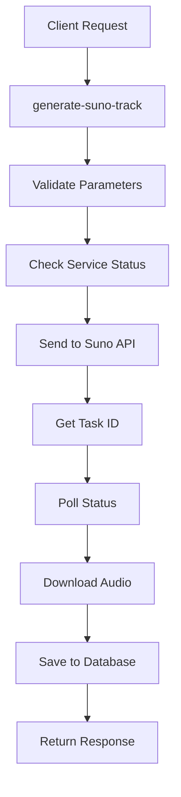
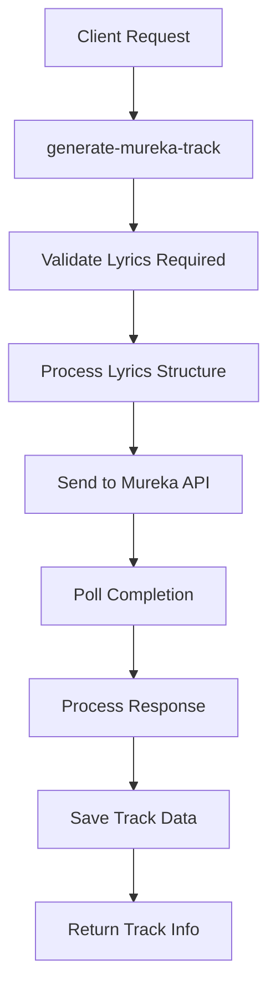

# 🎵 Полное руководство по AI API сервисам

## 📋 Обзор системы

AI Music Platform интегрирует множество AI сервисов для создания комплексной экосистемы музыкальной генерации. Система построена на модульной архитектуре с четким разделением обязанностей и единым интерфейсом для всех сервисов.

## 🏗️ Архитектура системы

### Структура проекта
```
🎵 AI Music Platform
├── 🎼 Music Generation APIs
│   ├── Suno AI (Text-to-Music)
│   ├── Mureka AI (Creative Compositions)
│   └── SunoAPI.org (Extended Features)
├── 🗣️ AI Content Generation
│   ├── OpenAI (GPT Models)
│   ├── Anthropic (Claude)
│   └── DeepSeek (Cost-effective)
├── 📊 Status Monitoring
│   ├── Health Checks
│   ├── Credit Tracking
│   └── Rate Limit Monitoring
└── 🔄 Edge Functions
    ├── Generation Pipeline
    ├── Status Checks
    └── Content Processing
```

## 🎼 Music Generation APIs

### 1. Suno AI Service
**Основной сервис для генерации музыки из текстовых описаний**

#### API Endpoints:
- **Base URL**: `https://api.sunoapi.org`
- **Authentication**: Bearer Token (`SUNOAPI_ORG_TOKEN`)
- **Rate Limits**: 5 запросов / 10 минут

#### Ключевые возможности:
```typescript
interface SunoCapabilities {
  textToMusic: true;           // Генерация из текста
  lyricsGeneration: true;      // Создание текстов
  styleTransfer: true;         // Изменение стиля
  vocalSeparation: true;       // Разделение вокала
  formatConversion: true;      // Конвертация WAV
  trackExtension: true;        // Расширение треков
  coverGeneration: true;       // Создание обложек
  videoGeneration: true;       // Видео из аудио
}
```

#### Модели и параметры:
```typescript
interface SunoModels {
  "V3_5": {
    maxDuration: 240;          // 4 минуты
    quality: "standard";
    features: ["vocals", "instruments"];
  };
  "V4": {
    maxDuration: 240;          // 4 минуты  
    quality: "improved_vocals";
    features: ["enhanced_clarity"];
  };
  "V4_5": {
    maxDuration: 480;          // 8 минут
    quality: "professional";
    features: ["smart_prompts", "fast_generation"];
  };
  "V4_5PLUS": {
    maxDuration: 480;          // 8 минут
    quality: "studio";
    features: ["richest_sound", "creative_modes"];
  };
}
```

#### API Integration:

**1. Проверка статуса и кредитов:**
```typescript
// Edge Function: check-suno-status
const response = await fetch('https://api.sunoapi.org/api/v1/generate/credit', {
  headers: {
    'Authorization': `Bearer ${SUNOAPI_ORG_TOKEN}`,
    'Content-Type': 'application/json'
  }
});

// Response format:
{
  "code": 200,
  "msg": "success",
  "data": 483.2  // Available credits
}
```

**2. Генерация трека:**
```typescript
// Edge Function: generate-suno-track
const generateRequest = {
  defaultParamFlag: true,
  prompt: "Upbeat electronic dance music with heavy bass",
  style: "Electronic, EDM, House, 128 BPM",
  title: "Энергичный Танец",
  model: "V4_5",
  negativeTags: "slow, acoustic",
  vocalGender: "f",
  styleWeight: 0.7,
  callBackUrl: "https://your-domain.supabase.co/functions/v1/suno-callback"
};

const result = await fetch('https://api.sunoapi.org/api/v1/generate/music', {
  method: 'POST',
  headers: {
    'Authorization': `Bearer ${SUNOAPI_ORG_TOKEN}`,
    'Content-Type': 'application/json'
  },
  body: JSON.stringify(generateRequest)
});
```

**3. Расширение трека:**
```typescript
// Edge Function: extend-suno-track
const extendRequest = {
  defaultParamFlag: true,
  audioId: "existing-track-id",
  prompt: "Add more energy and drums",
  continueAt: 60, // seconds
  model: "V4_5",
  callBackUrl: callback_url
};
```

### 2. Mureka AI Service  
**Креативный сервис для экспериментальных композиций**

#### API Details:
- **Base URL**: `https://api.mureka.ai`
- **Authentication**: Bearer Token (`MUREKA_API_KEY`)
- **Rate Limits**: 10 запросов / 15 минут

#### Специализированные возможности:
```typescript
interface MurekaCapabilities {
  lyricsGeneration: true;      // Продвинутая генерация текстов
  lyricsExtension: true;       // Расширение текстов
  songExtension: true;         // Расширение композиций
  instrumentalGeneration: true; // Инструментальная музыка
  stemSeparation: true;        // Разделение стемов
  fileUpload: true;           // Загрузка аудио файлов
  modelVariety: true;         // Множество моделей
}
```

#### Модели Mureka:
```typescript
interface MurekaModels {
  "auto": {
    description: "Автоматический выбор модели";
    bestFor: "general_purpose";
  };
  "mureka-6": {
    description: "Стандартная модель";
    bestFor: "balanced_quality";
  };
  "mureka-7": {
    description: "Улучшенная модель";
    bestFor: "high_quality";
  };
  "mureka-o1": {
    description: "Экспериментальная модель";
    bestFor: "creative_experiments";
  };
}
```

#### Billing и Credits:
```typescript
// Проверка баланса: GET /v1/account/billing
interface MurekaBilling {
  account_id: number;
  balance: number;            // В центах!
  total_recharge: number;     // Общее пополнение
  total_spending: number;     // Потрачено
  concurrent_request_limit: number;
}

// Конвертация в доллары: balance / 100
```

### 3. SunoAPI.org Service
**Расширенные возможности через SunoAPI.org**

#### Дополнительные функции:
- **File Upload**: Загрузка аудио файлов
- **Style Boost**: Усиление стилей
- **Cover Generation**: Создание кавер-версий
- **Video Generation**: Создание видео из аудио

## 🧠 AI Content Generation Services

### 1. OpenAI Integration
```typescript
interface OpenAIConfig {
  baseUrl: "https://api.openai.com/v1";
  models: {
    "gpt-5-2025-08-07": "flagship_model";
    "gpt-5-mini-2025-08-07": "fast_efficient";
    "gpt-4.1-2025-04-14": "reliable_gpt4";
    "o3-2025-04-16": "reasoning_model";
    "o4-mini-2025-04-16": "fast_reasoning";
  };
  apiKey: "OPENAI_API_KEY";
  features: ["text_generation", "content_analysis", "translation"];
}
```

### 2. Anthropic Claude
```typescript
interface AnthropicConfig {
  baseUrl: "https://api.anthropic.com/v1";
  models: {
    "claude-3-opus-20240229": "most_powerful";
    "claude-3-sonnet-20240229": "balanced";
    "claude-3-haiku-20240307": "fastest";
  };
  apiKey: "ANTHROPIC_API_KEY";
  features: ["creative_writing", "detailed_analysis"];
}
```

### 3. DeepSeek AI
```typescript
interface DeepSeekConfig {
  baseUrl: "https://api.deepseek.com/v1";
  models: {
    "deepseek-chat": "general_chat";
    "deepseek-coder": "code_assistance";
  };
  apiKey: "DEEPSEEK_API_KEY";
  features: ["cost_effective", "good_quality"];
}
```

## 📊 Status Monitoring System

### Real-time Service Health
```typescript
interface ServiceStatus {
  service: 'suno' | 'mureka';
  status: 'online' | 'offline' | 'limited' | 'checking';
  creditsRemaining?: number;
  creditsTotal?: number;
  rateLimit?: {
    remaining: number;
    resetTime: Date;
  };
  lastChecked: Date;
  error?: string;
}
```

### Автоматический мониторинг:
- **Интервал проверки**: каждые 30 секунд
- **Health checks**: проверка доступности API
- **Credit tracking**: отслеживание баланса
- **Rate limit monitoring**: контроль лимитов запросов

## 🔄 Edge Functions Architecture

### Core Functions Pipeline:

#### 1. Generation Functions
```
generate-suno-track/
├── index.ts                 # Основная логика генерации
├── validation.ts           # Валидация входных данных
├── api-client.ts          # Клиент Suno API
└── response-handler.ts    # Обработка ответов

generate-mureka-track/
├── index.ts               # Логика Mureka генерации
├── lyrics-processor.ts    # Обработка текстов
└── file-handler.ts       # Работа с файлами
```

#### 2. Status Functions
```
check-suno-status/
└── index.ts              # Проверка статуса Suno

check-mureka-status/
└── index.ts              # Проверка статуса Mureka
```

#### 3. Extended Features
```
extend-suno-track/         # Расширение треков
generate-suno-lyrics/      # Генерация текстов
convert-suno-to-wav/       # Конвертация форматов
separate-suno-vocals/      # Разделение вокала
generate-suno-cover/       # Создание кавер-версий
```

### Request/Response Flow:

#### Suno Generation Flow:


#### Mureka Generation Flow:


## 🔧 Configuration Management

### Environment Variables:
```bash
# Music Generation APIs
SUNOAPI_ORG_TOKEN=sk-xxxxx        # Suno API token
MUREKA_API_KEY=mk-xxxxx           # Mureka API key

# AI Content Generation
OPENAI_API_KEY=sk-xxxxx           # OpenAI API key
ANTHROPIC_API_KEY=sk-ant-xxxxx    # Anthropic API key
DEEPSEEK_API_KEY=sk-xxxxx         # DeepSeek API key

# Platform Configuration
SUPABASE_URL=https://xxx.supabase.co
SUPABASE_ANON_KEY=eyJxxx
SUPABASE_SERVICE_ROLE_KEY=eyJxxx
```

### User Settings Integration:
```typescript
interface AISettings {
  provider: 'openai' | 'anthropic' | 'deepseek';
  model: string;
  temperature: number;
  maxTokens: number;
  customPrompts: {
    artistGeneration: string;
    lyricsGeneration: string;
    marketingMaterials: string;
    trackConceptGeneration: string;
    trackDescriptionGeneration: string;
  };
}
```

## 🚨 Error Handling & Resilience

### Common Error Patterns:

#### 1. Authentication Errors
```typescript
// Suno API
{
  "code": 401,
  "msg": "Invalid API key",
  "data": null
}

// Mureka API  
{
  "error": "Unauthorized",
  "status": 401
}
```

#### 2. Rate Limit Errors
```typescript
// Suno Rate Limit
{
  "code": 430,
  "msg": "Your call frequency is too high. Please try again later.",
  "data": null
}

// Mureka Rate Limit
{
  "error": "Rate limit exceeded",
  "status": 429,
  "retry_after": 60
}
```

#### 3. Insufficient Credits
```typescript
// Suno Credits
{
  "code": 429,
  "msg": "Insufficient credits",
  "data": {
    "remaining": 0.2,
    "required": 1.0
  }
}
```

### Retry Logic:
```typescript
class APIRetryHandler {
  async withRetry(operation: () => Promise<any>, maxRetries: number = 3) {
    for (let attempt = 1; attempt <= maxRetries; attempt++) {
      try {
        return await operation();
      } catch (error) {
        if (attempt === maxRetries) throw error;
        
        const delay = Math.pow(2, attempt) * 1000; // Exponential backoff
        await new Promise(resolve => setTimeout(resolve, delay));
      }
    }
  }
}
```

## 📈 Performance Optimization

### Caching Strategy:
```typescript
interface CacheStrategy {
  userSettings: "10_minutes";      // AI settings cache
  serviceStatus: "30_seconds";     // Status cache
  generationResults: "24_hours";   // Result cache
  trackMetadata: "1_hour";         // Metadata cache
}
```

### Request Batching:
```typescript
class RequestBatcher {
  private batch: GenerationRequest[] = [];
  private batchTimeout: NodeJS.Timeout | null = null;
  
  addToBatch(request: GenerationRequest) {
    this.batch.push(request);
    
    if (this.batch.length >= 5) {
      this.processBatch();
    } else {
      this.scheduleBatchProcessing();
    }
  }
}
```

## 🔒 Security Best Practices

### API Key Management:
```typescript
// ✅ Secure: Environment variables
const apiKey = process.env.SUNO_API_TOKEN;

// ❌ Insecure: Hardcoded keys
// const apiKey = "sk-1234567890abcdef";

// Key validation
const validateApiKey = (key: string, service: string): boolean => {
  const patterns = {
    suno: /^sk-[a-zA-Z0-9]{20,}$/,
    mureka: /^mk-[a-zA-Z0-9]{20,}$/,
    openai: /^sk-[a-zA-Z0-9]{20,}$/
  };
  
  return patterns[service]?.test(key) || false;
};
```

### Input Sanitization:
```typescript
const sanitizePrompt = (prompt: string): string => {
  return prompt
    .trim()
    .replace(/[<>]/g, '') // Remove HTML tags
    .substring(0, 500);   // Limit length
};

const validateDuration = (duration: number): boolean => {
  return duration >= 10 && duration <= 480; // 10s to 8min
};
```

## 📊 Monitoring & Analytics

### Key Metrics:
```typescript
interface ServiceMetrics {
  // Performance metrics
  successRate: number;        // 0-100%
  avgResponseTime: number;    // milliseconds
  errorRate: number;          // 0-100%
  
  // Usage metrics
  requestsPerHour: number;
  creditsConsumed: number;
  popularGenres: string[];
  
  // Cost metrics
  costPerGeneration: number;
  totalMonthlyCost: number;
  costEfficiency: number;
}
```

### Real-time Dashboard:
```typescript
const getDashboardData = async () => {
  const services = await getServiceStatuses();
  const metrics = await getServiceMetrics();
  const recentGenerations = await getRecentGenerations();
  
  return {
    serviceHealth: services,
    performanceMetrics: metrics,
    recentActivity: recentGenerations,
    systemLoad: await getSystemLoad()
  };
};
```

## 🎯 Best Practices

### 1. Prompt Engineering
```typescript
const optimizedPrompts = {
  // Specific and descriptive
  good: "Upbeat electronic dance music with synthesizers",
  
  // Include musical details
  better: "Upbeat EDM track in F# minor, 128 BPM, with heavy synthesizers and energetic female vocals",
  
  // Complete musical direction
  best: "Energetic progressive house track in F# minor, 128 BPM, featuring layered synthesizers, deep bass, rhythmic hi-hats, and powerful female vocals with slight reverb, building to an euphoric drop"
};
```

### 2. Cost Optimization
```typescript
const costOptimization = {
  // Use appropriate models
  modelSelection: {
    previews: "V3_5",      // Lower cost for demos
    production: "V4_5",    // Higher quality for final
    experimental: "V4_5PLUS" // Premium for special projects
  },
  
  // Batch similar requests
  batchProcessing: true,
  
  // Cache frequent requests
  enableCaching: true,
  
  // Monitor usage
  setLimits: {
    dailyLimit: 100,
    userLimit: 10
  }
};
```

### 3. Quality Assurance
```typescript
const qualityChecks = {
  // Pre-generation validation
  validateRequest: (request) => {
    return request.prompt.length > 10 &&
           request.duration >= 30 &&
           request.style !== undefined;
  },
  
  // Post-generation validation
  validateResult: (result) => {
    return result.audioUrl &&
           result.duration > 0 &&
           result.fileSize > 1024; // > 1KB
  }
};
```

## 🔮 Future Roadmap

### Planned Integrations:
- **Udio AI**: Alternative music generation
- **ElevenLabs**: Voice synthesis and cloning
- **LANDR**: Audio mastering and enhancement
- **Stability AI**: Audio generation models

### Upcoming Features:
- Real-time collaboration
- Multi-language support
- Advanced audio processing
- AI-powered mixing and mastering

## 📞 Support & Troubleshooting

### Common Issues:

1. **"Service Offline"**
   - Check API keys in Supabase secrets
   - Verify service status on provider websites
   - Check rate limits and credits

2. **"Generation Failed"**
   - Validate prompt format and length
   - Check service-specific requirements
   - Review error logs in Edge Functions

3. **"Slow Performance"**
   - Monitor service response times
   - Check network connectivity
   - Consider load balancing

### Debug Tools:
```typescript
// Enable debug mode
process.env.AI_DEBUG = 'true';

// Check service health
const health = await checkAllServices();
console.log('Services health:', health);

// Monitor API calls
const apiLogger = new APILogger({
  logRequests: true,
  logResponses: true,
  logErrors: true
});
```

---

*Эта документация актуальна на дату: 2025-01-17*  
*Для обновлений следите за changelog в репозитории*