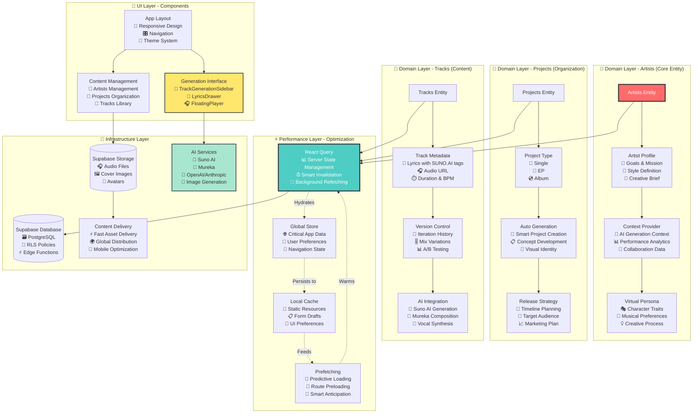
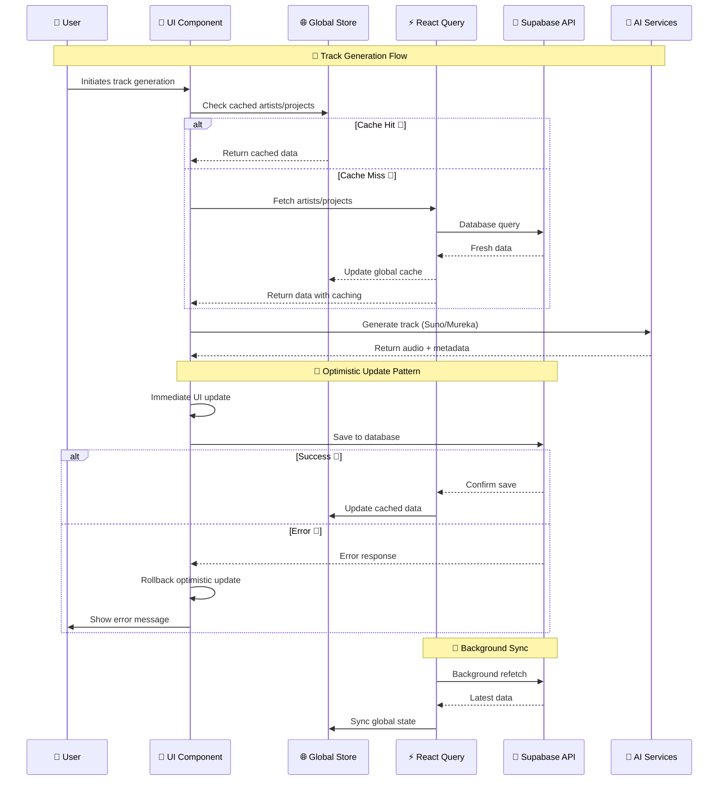
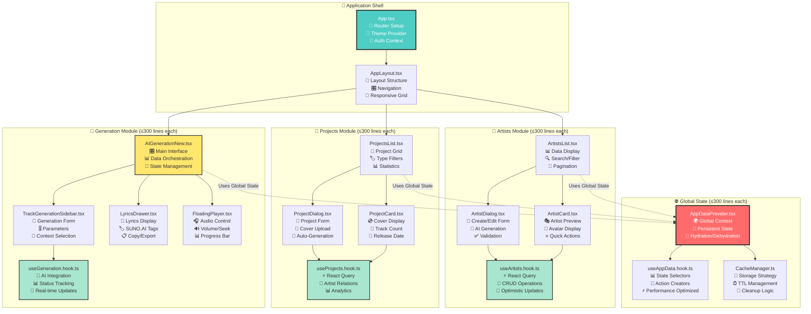
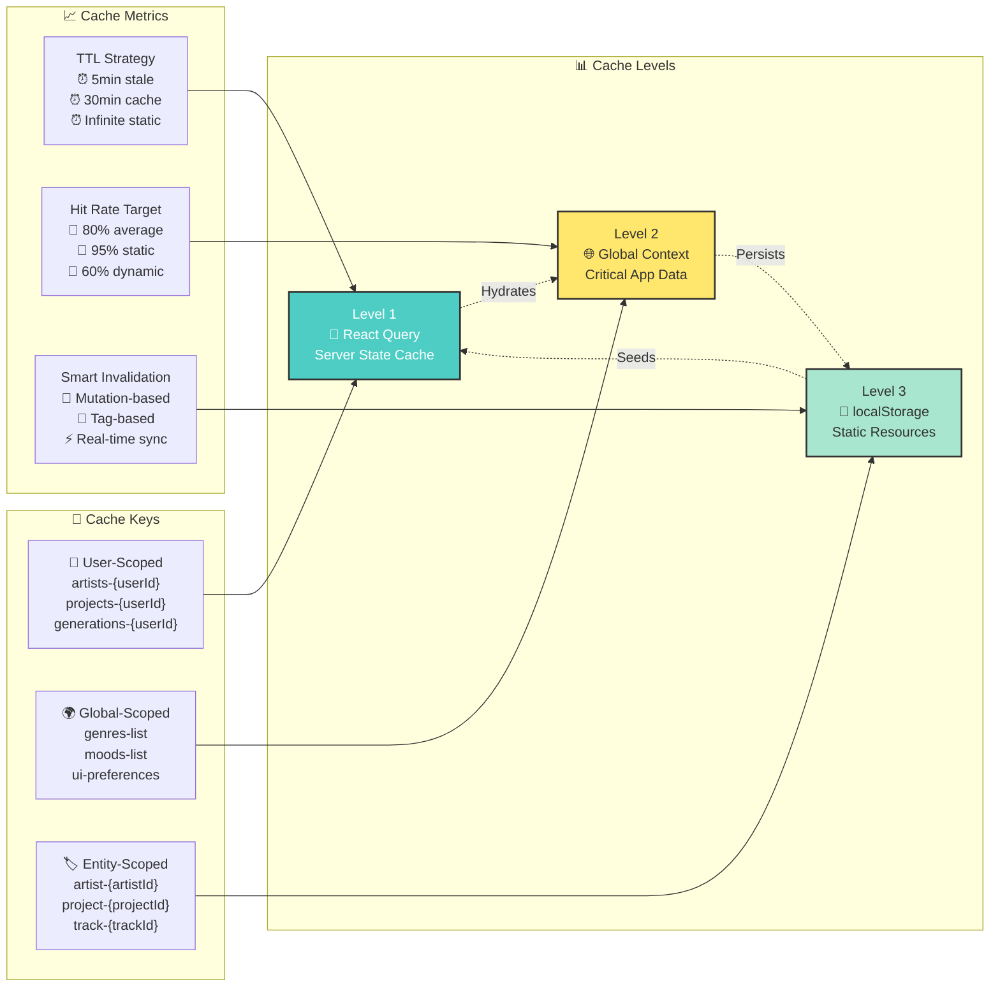

# 🏗️ AI Music Platform - Архитектурные диаграммы

> **Версия**: 0.01.032  
> **Назначение**: Визуализация архитектуры системы с фокусом на оптимизацию производительности  
> **Связанные документы**: [Optimization Plan](./optimization-plan.md), [CLAUDE.md](../CLAUDE.md)

## 🎯 Общая архитектура системы



## 🔄 Data Flow Architecture



## 🏗️ Component Architecture



## 🔄 Caching Strategy



## 🎨 Cover Generation Flow

```mermaid
flowchart TD
    Start([🎵 Track Created]) --> CheckMode{Cover Generation Mode?}
    
    CheckMode -->|"Default"| DefaultGen[🤖 SunoAPI.org<br/>Auto-generate from<br/>track metadata]
    CheckMode -->|"Custom"| CustomGen[🎨 Custom Prompt<br/>User-defined<br/>style & content]
    
    DefaultGen --> GenPrompt1[🧠 Create Prompt<br/>Title: {track.title}<br/>Genre: {track.genre}<br/>Mood: {track.mood}]
    
    CustomGen --> ProviderSelect[🎯 Provider Selection<br/>• Stability AI<br/>• DALL-E 3<br/>• Midjourney<br/>• SunoAPI.org]
    
    GenPrompt1 --> CallAPI1[📡 Call SunoAPI.org<br/>POST /generate-cover]
    ProviderSelect --> GenPrompt2[📝 User Prompt Input<br/>+ Style Parameters]
    GenPrompt2 --> CallAPI2[📡 Call Selected Provider<br/>With custom parameters]
    
    CallAPI1 --> ProcessResult1[🖼️ Process Result<br/>• Validate image<br/>• Generate variants<br/>• Store metadata]
    
    CallAPI2 --> ProcessResult2[🖼️ Process Result<br/>• Quality check<br/>• Resize variants<br/>• Store metadata]
    
    ProcessResult1 --> StoreImage[💾 Store in Supabase<br/>• Original file<br/>• Thumbnails<br/>• Metadata JSON]
    ProcessResult2 --> StoreImage
    
    StoreImage --> UpdateTrack[📝 Update Track Record<br/>cover_url = generated_url<br/>cover_metadata = details]
    
    UpdateTrack --> ShowOptions{Show Regeneration Options?}
    
    ShowOptions -->|"Yes"| RegenerateUI[🔄 Regeneration Interface<br/>• Try different prompt<br/>• Change provider<br/>• Adjust parameters]
    
    ShowOptions -->|"No"| Complete([✅ Cover Generation Complete])
    
    RegenerateUI --> CustomGen
    
    style Start fill:#4ecdc4,stroke:#333,stroke-width:2px,color:#fff
    style DefaultGen fill:#a8e6cf,stroke:#333,stroke-width:2px
    style CustomGen fill:#ffe66d,stroke:#333,stroke-width:2px
    style Complete fill:#ff6b6b,stroke:#333,stroke-width:2px,color:#fff
```

---

> **Документация обновляется**: По мере реализации оптимизаций диаграммы будут дополняться деталями имплементации.

**Связанные файлы**:
- [Optimization Plan](./optimization-plan.md) - Детальный план реализации
- [CLAUDE.md](../CLAUDE.md) - Основная документация проекта  
- [README.md](../README.md) - Точка входа в документацию

**TODO**:
- [ ] Добавить диаграммы для AI интеграции
- [ ] Детализировать error handling flows  
- [ ] Создать performance monitoring диаграммы
- [ ] Добавить security архитектуру