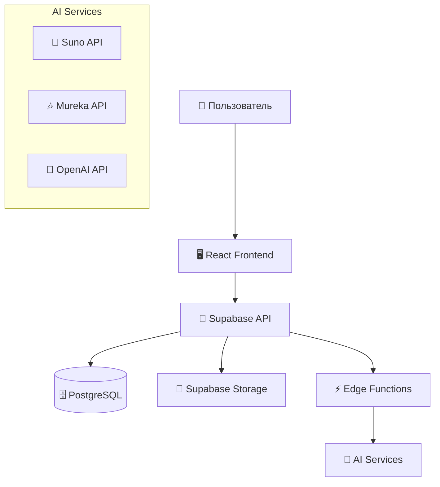
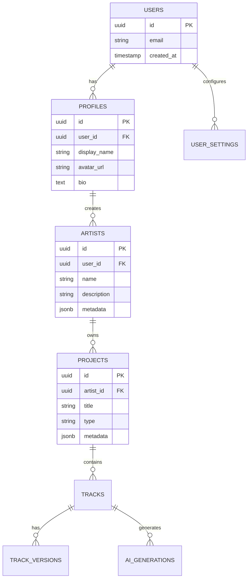
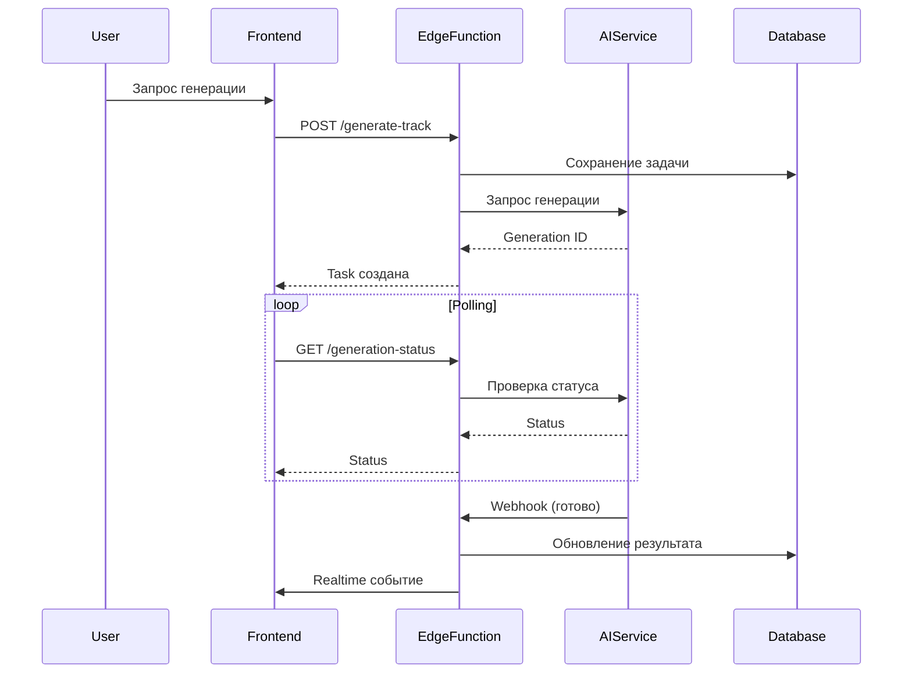

# 🏗️ Архитектура системы

> **Детальное описание архитектуры AI Music Platform**

---

## 📋 **Содержание**

1. [Общая архитектура](#общая-архитектура)
2. [Frontend архитектура](#frontend-архитектура)
3. [Backend архитектура](#backend-архитектура)
4. [Модель данных](#модель-данных)
5. [AI интеграции](#ai-интеграции)
6. [Безопасность](#безопасность)

---

## 🎯 **Общая архитектура**

AI Music Platform построена по модульной архитектуре с четким разделением ответственности:



---

## 🖥️ **Frontend архитектура**

### **Технологический стек**
- **React 18** - библиотека UI
- **TypeScript** - типизация
- **Vite** - сборщик
- **Tailwind CSS** - стили
- **shadcn/ui** - UI компоненты
- **TanStack Query** - состояние и кеширование
- **React Router** - маршрутизация

### **Слоевая архитектура**

```
┌─────────────────────────────────────┐
│           🎨 Presentation           │
│        (Routes, Components)         │
├─────────────────────────────────────┤
│          🎯 Business Logic          │
│         (Features, Hooks)           │
├─────────────────────────────────────┤
│          🔌 Data Access             │
│         (Services, API)             │
├─────────────────────────────────────┤
│           🛠️ Infrastructure         │
│        (Utils, Config)              │
└─────────────────────────────────────┘
```

### **Модульная организация**

**Routes** - Страницы приложения
```typescript
// routes/landing.tsx - Посадочная страница
// routes/dashboard.tsx - Главная панель
// routes/auth/ - Авторизация
```

**Components** - UI компоненты
```typescript
// components/landing/ - Блоки landing
// components/dashboard/ - Элементы дашборда  
// components/settings/ - Панель настроек
// components/shared/ - Общие компоненты
```

**Features** - Бизнес-логика
```typescript
// features/artists/ - Логика артистов
// features/projects/ - Логика проектов
// features/tracks/ - Логика треков
// features/ai/ - AI интеграции
```

---

## ⚡ **Backend архитектура**

### **Supabase Stack**
- **PostgreSQL** - основная БД
- **Row Level Security** - безопасность на уровне строк
- **Storage** - файловое хранилище
- **Edge Functions** - serverless API
- **Realtime** - WebSocket подключения

### **Edge Functions**

```typescript
// supabase/functions/generate-track/
// Генерация треков через AI API

// supabase/functions/process-audio/
// Обработка аудиофайлов

// supabase/functions/ai-assistant/
// AI помощник для проектов
```

### **API Design**

**RESTful принципы**
```
GET    /api/projects     - Список проектов
POST   /api/projects     - Создание проекта
GET    /api/projects/:id - Получение проекта
PUT    /api/projects/:id - Обновление проекта
DELETE /api/projects/:id - Удаление проекта
```

**RPC функции**
```sql
-- Генерация AI трека
SELECT generate_ai_track(project_id, prompt, style);

-- Получение статистики
SELECT get_user_stats(user_id);
```

---

## 🗄️ **Модель данных**

### **Основные сущности**



### **Принципы проектирования БД**

1. **Нормализация** - 3НФ для устранения избыточности
2. **Индексы** - на часто запрашиваемые поля
3. **Ограничения** - для целостности данных
4. **RLS политики** - для безопасности
5. **Аудит** - created_at, updated_at для всех таблиц

---

## 🧠 **AI интеграции**

### **Архитектура AI сервисов**

```typescript
interface AIService {
  generateTrack(prompt: string, options: GenerationOptions): Promise<Track>;
  getStatus(generationId: string): Promise<GenerationStatus>;
  cancelGeneration(generationId: string): Promise<void>;
}

class SunoService implements AIService {
  // Реализация для Suno API
}

class MurekaService implements AIService {
  // Реализация для Mureka API
}
```

### **Workflow генерации**



---

## 🔒 **Безопасность**

### **Аутентификация и авторизация**

1. **Supabase Auth** - JWT токены
2. **Row Level Security** - политики доступа к данным
3. **API ключи** - безопасное хранение в Supabase Vault
4. **CORS** - настройка для фронтенда

### **RLS политики**

```sql
-- Пример: пользователи видят только свои проекты
CREATE POLICY "Users can view own projects" 
ON projects FOR SELECT 
USING (artist_id IN (
  SELECT id FROM artists WHERE user_id = auth.uid()
));
```

### **Валидация данных**

```typescript
// Zod схемы для валидации
const ProjectSchema = z.object({
  title: z.string().min(1).max(100),
  type: z.enum(['album', 'single', 'ep']),
  metadata: z.record(z.any()).optional()
});
```

---

## 📊 **Производительность**

### **Фронтенд оптимизации**

1. **Code Splitting** - ленивая загрузка маршрутов
2. **React.memo** - мемоизация компонентов
3. **TanStack Query** - кеширование API запросов
4. **Виртуализация** - для больших списков

### **Бэкенд оптимизации**

1. **Индексы БД** - на часто запрашиваемые поля
2. **Connection Pooling** - пул соединений
3. **CDN** - для статических файлов
4. **Edge Functions** - географическое распределение

---

## 🚀 **Масштабирование**

### **Горизонтальное масштабирование**

1. **Supabase** - автоматическое масштабирование
2. **Edge Functions** - serverless архитектура
3. **CDN** - глобальное кеширование
4. **Микросервисы** - разделение по доменам

### **Вертикальное масштабирование**

1. **Database** - увеличение ресурсов
2. **Storage** - расширение хранилища
3. **Compute** - увеличение мощности функций

---

## 📈 **Мониторинг и логирование**

### **Метрики**

1. **Performance** - время отклика API
2. **Usage** - количество генераций
3. **Errors** - частота ошибок
4. **User Activity** - активность пользователей

### **Логирование**

```typescript
// Структурированные логи
logger.info('Track generation started', {
  userId: user.id,
  projectId: project.id,
  aiService: 'suno',
  timestamp: new Date().toISOString()
});
```

---

**Документация обновлена:** `2025-07-31 15:30`  
**Версия архитектуры:** `v1.0.0`