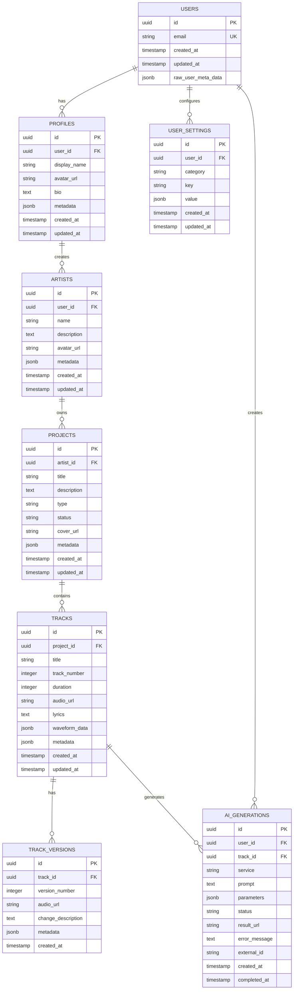

# 🗄️ База данных

> **Подробная схема и описание базы данных AI Music Platform**

---

## 📋 **Содержание**

1. [Обзор схемы](#обзор-схемы)
2. [Таблицы](#таблицы)
3. [Связи](#связи)
4. [RLS политики](#rls-политики)
5. [Индексы](#индексы)
6. [Функции и триггеры](#функции-и-триггеры)
7. [Миграции](#миграции)

---

## 🎯 **Обзор схемы**

База данных построена на PostgreSQL с использованием принципов:

- **Нормализация 3НФ** - устранение избыточности
- **Row Level Security** - безопасность на уровне строк
- **Аудит изменений** - отслеживание created_at/updated_at
- **Индексация** - оптимизация запросов
- **Ограничения целостности** - валидация данных

### **ER диаграмма**



---

## 📊 **Таблицы**

### **profiles**
```sql
CREATE TABLE public.profiles (
  id UUID NOT NULL DEFAULT gen_random_uuid() PRIMARY KEY,
  user_id UUID NOT NULL UNIQUE REFERENCES auth.users(id) ON DELETE CASCADE,
  display_name TEXT,
  avatar_url TEXT,
  bio TEXT,
  metadata JSONB DEFAULT '{}'::jsonb,
  created_at TIMESTAMP WITH TIME ZONE NOT NULL DEFAULT now(),
  updated_at TIMESTAMP WITH TIME ZONE NOT NULL DEFAULT now()
);
```

**Описание полей:**
- `user_id` - ссылка на пользователя auth.users
- `display_name` - отображаемое имя пользователя
- `avatar_url` - URL аватара пользователя
- `bio` - биография/описание
- `metadata` - дополнительные данные (социальные сети, настройки)

### **artists**
```sql
CREATE TABLE public.artists (
  id UUID NOT NULL DEFAULT gen_random_uuid() PRIMARY KEY,
  user_id UUID NOT NULL REFERENCES auth.users(id) ON DELETE CASCADE,
  name TEXT NOT NULL,
  description TEXT,
  avatar_url TEXT,
  metadata JSONB DEFAULT '{}'::jsonb,
  created_at TIMESTAMP WITH TIME ZONE NOT NULL DEFAULT now(),
  updated_at TIMESTAMP WITH TIME ZONE NOT NULL DEFAULT now(),
  
  CONSTRAINT unique_artist_name_per_user UNIQUE (user_id, name)
);
```

**Описание полей:**
- `user_id` - владелец артиста
- `name` - название артиста/группы
- `description` - описание артиста
- `metadata` - жанры, локация, контакты

**Пример metadata:**
```json
{
  "genres": ["Electronic", "Ambient"],
  "location": "Moscow, Russia",
  "website": "https://artist.com",
  "social": {
    "instagram": "@artist",
    "spotify": "artist_id"
  }
}
```

### **projects**
```sql
CREATE TABLE public.projects (
  id UUID NOT NULL DEFAULT gen_random_uuid() PRIMARY KEY,
  artist_id UUID NOT NULL REFERENCES public.artists(id) ON DELETE CASCADE,
  title TEXT NOT NULL,
  description TEXT,
  type TEXT NOT NULL CHECK (type IN ('album', 'single', 'ep')),
  status TEXT NOT NULL DEFAULT 'draft' CHECK (status IN ('draft', 'published', 'archived')),
  cover_url TEXT,
  metadata JSONB DEFAULT '{}'::jsonb,
  created_at TIMESTAMP WITH TIME ZONE NOT NULL DEFAULT now(),
  updated_at TIMESTAMP WITH TIME ZONE NOT NULL DEFAULT now()
);
```

**Описание полей:**
- `artist_id` - ссылка на артиста
- `type` - тип проекта (album/single/ep)
- `status` - статус публикации
- `cover_url` - обложка проекта

**Пример metadata:**
```json
{
  "release_date": "2025-12-01",
  "genre": "Electronic",
  "label": "Independent",
  "catalog_number": "IND-001",
  "total_duration": 2400
}
```

### **tracks**
```sql
CREATE TABLE public.tracks (
  id UUID NOT NULL DEFAULT gen_random_uuid() PRIMARY KEY,
  project_id UUID NOT NULL REFERENCES public.projects(id) ON DELETE CASCADE,
  title TEXT NOT NULL,
  track_number INTEGER NOT NULL,
  duration INTEGER, -- seconds
  audio_url TEXT,
  lyrics TEXT,
  waveform_data JSONB,
  metadata JSONB DEFAULT '{}'::jsonb,
  created_at TIMESTAMP WITH TIME ZONE NOT NULL DEFAULT now(),
  updated_at TIMESTAMP WITH TIME ZONE NOT NULL DEFAULT now(),
  
  CONSTRAINT unique_track_number_per_project UNIQUE (project_id, track_number),
  CONSTRAINT positive_track_number CHECK (track_number > 0),
  CONSTRAINT positive_duration CHECK (duration IS NULL OR duration > 0)
);
```

**Описание полей:**
- `track_number` - номер трека в проекте
- `duration` - длительность в секундах
- `waveform_data` - данные для визуализации звука
- `lyrics` - текст песни

**Пример waveform_data:**
```json
{
  "peaks": [0.1, 0.3, 0.8, 0.6, ...],
  "sample_rate": 44100,
  "samples_per_pixel": 512
}
```

### **track_versions**
```sql
CREATE TABLE public.track_versions (
  id UUID NOT NULL DEFAULT gen_random_uuid() PRIMARY KEY,
  track_id UUID NOT NULL REFERENCES public.tracks(id) ON DELETE CASCADE,
  version_number INTEGER NOT NULL,
  audio_url TEXT NOT NULL,
  change_description TEXT,
  metadata JSONB DEFAULT '{}'::jsonb,
  created_at TIMESTAMP WITH TIME ZONE NOT NULL DEFAULT now(),
  
  CONSTRAINT unique_version_per_track UNIQUE (track_id, version_number),
  CONSTRAINT positive_version_number CHECK (version_number > 0)
);
```

**Описание полей:**
- `version_number` - номер версии трека
- `change_description` - описание изменений
- `audio_url` - URL аудиофайла версии

### **ai_generations**
```sql
CREATE TABLE public.ai_generations (
  id UUID NOT NULL DEFAULT gen_random_uuid() PRIMARY KEY,
  user_id UUID NOT NULL REFERENCES auth.users(id) ON DELETE CASCADE,
  track_id UUID REFERENCES public.tracks(id) ON DELETE SET NULL,
  service TEXT NOT NULL CHECK (service IN ('suno', 'mureka', 'openai')),
  prompt TEXT NOT NULL,
  parameters JSONB DEFAULT '{}'::jsonb,
  status TEXT NOT NULL DEFAULT 'pending' CHECK (status IN ('pending', 'processing', 'completed', 'failed')),
  result_url TEXT,
  error_message TEXT,
  external_id TEXT, -- ID во внешнем сервисе
  created_at TIMESTAMP WITH TIME ZONE NOT NULL DEFAULT now(),
  completed_at TIMESTAMP WITH TIME ZONE
);
```

**Описание полей:**
- `service` - AI сервис (suno/mureka/openai)
- `prompt` - текстовое описание для генерации
- `parameters` - параметры генерации
- `external_id` - ID задачи во внешнем API

**Пример parameters:**
```json
{
  "genre": "electronic",
  "mood": "energetic",
  "duration": 120,
  "key": "C major",
  "bpm": 128,
  "instruments": ["synthesizer", "drums"]
}
```

### **user_settings**
```sql
CREATE TABLE public.user_settings (
  id UUID NOT NULL DEFAULT gen_random_uuid() PRIMARY KEY,
  user_id UUID NOT NULL REFERENCES auth.users(id) ON DELETE CASCADE,
  category TEXT NOT NULL,
  key TEXT NOT NULL,
  value JSONB NOT NULL,
  created_at TIMESTAMP WITH TIME ZONE NOT NULL DEFAULT now(),
  updated_at TIMESTAMP WITH TIME ZONE NOT NULL DEFAULT now(),
  
  CONSTRAINT unique_setting_per_user UNIQUE (user_id, category, key)
);
```

**Описание полей:**
- `category` - категория настройки (ui/ai/security)
- `key` - ключ настройки
- `value` - значение настройки в JSON

**Примеры настроек:**
```json
// UI настройки
{"category": "ui", "key": "theme", "value": "dark"}
{"category": "ui", "key": "language", "value": "ru"}

// AI настройки  
{"category": "ai", "key": "default_service", "value": "suno"}
{"category": "ai", "key": "default_genre", "value": "electronic"}
```

---

## 🔗 **Связи между таблицами**

### **Основные связи**

1. **users → profiles** (1:1)
   - Один пользователь = один профиль
   - Каскадное удаление

2. **users → artists** (1:M)
   - Пользователь может создать несколько артистов
   - Каскадное удаление

3. **artists → projects** (1:M)
   - Артист может иметь множество проектов
   - Каскадное удаление

4. **projects → tracks** (1:M)
   - Проект содержит множество треков
   - Каскадное удаление

5. **tracks → track_versions** (1:M)
   - Трек может иметь множество версий
   - Каскадное удаление

6. **tracks → ai_generations** (1:M)
   - Трек может быть сгенерирован несколько раз
   - SET NULL при удалении трека

---

## 🔒 **RLS политики**

### **profiles**
```sql
-- Пользователи видят только свой профиль
CREATE POLICY "Users can view own profile" 
ON public.profiles FOR SELECT 
USING (auth.uid() = user_id);

-- Пользователи могут обновлять свой профиль
CREATE POLICY "Users can update own profile" 
ON public.profiles FOR UPDATE 
USING (auth.uid() = user_id);

-- Пользователи могут создавать свой профиль
CREATE POLICY "Users can insert own profile" 
ON public.profiles FOR INSERT 
WITH CHECK (auth.uid() = user_id);
```

### **artists**
```sql
-- Пользователи видят только своих артистов
CREATE POLICY "Users can view own artists" 
ON public.artists FOR SELECT 
USING (auth.uid() = user_id);

-- Пользователи могут управлять своими артистами
CREATE POLICY "Users can manage own artists" 
ON public.artists FOR ALL 
USING (auth.uid() = user_id)
WITH CHECK (auth.uid() = user_id);
```

### **projects**
```sql
-- Пользователи видят проекты своих артистов
CREATE POLICY "Users can view own projects" 
ON public.projects FOR SELECT 
USING (artist_id IN (
  SELECT id FROM public.artists WHERE user_id = auth.uid()
));

-- Пользователи могут управлять проектами своих артистов
CREATE POLICY "Users can manage own projects" 
ON public.projects FOR ALL 
USING (artist_id IN (
  SELECT id FROM public.artists WHERE user_id = auth.uid()
))
WITH CHECK (artist_id IN (
  SELECT id FROM public.artists WHERE user_id = auth.uid()
));
```

### **tracks**
```sql
-- Пользователи видят треки своих проектов
CREATE POLICY "Users can view own tracks" 
ON public.tracks FOR SELECT 
USING (project_id IN (
  SELECT p.id FROM public.projects p
  JOIN public.artists a ON p.artist_id = a.id
  WHERE a.user_id = auth.uid()
));

-- Аналогично для других операций
CREATE POLICY "Users can manage own tracks" 
ON public.tracks FOR ALL 
USING (project_id IN (
  SELECT p.id FROM public.projects p
  JOIN public.artists a ON p.artist_id = a.id
  WHERE a.user_id = auth.uid()
))
WITH CHECK (project_id IN (
  SELECT p.id FROM public.projects p
  JOIN public.artists a ON p.artist_id = a.id
  WHERE a.user_id = auth.uid()
));
```

### **ai_generations**
```sql
-- Пользователи видят только свои генерации
CREATE POLICY "Users can view own generations" 
ON public.ai_generations FOR SELECT 
USING (auth.uid() = user_id);

-- Пользователи могут создавать и обновлять свои генерации
CREATE POLICY "Users can manage own generations" 
ON public.ai_generations FOR ALL 
USING (auth.uid() = user_id)
WITH CHECK (auth.uid() = user_id);
```

---

## 📊 **Индексы**

### **Основные индексы**
```sql
-- Профили
CREATE INDEX idx_profiles_user_id ON public.profiles(user_id);

-- Артисты
CREATE INDEX idx_artists_user_id ON public.artists(user_id);
CREATE INDEX idx_artists_name ON public.artists(name);

-- Проекты
CREATE INDEX idx_projects_artist_id ON public.projects(artist_id);
CREATE INDEX idx_projects_status ON public.projects(status);
CREATE INDEX idx_projects_type ON public.projects(type);
CREATE INDEX idx_projects_created_at ON public.projects(created_at DESC);

-- Треки
CREATE INDEX idx_tracks_project_id ON public.tracks(project_id);
CREATE INDEX idx_tracks_track_number ON public.tracks(project_id, track_number);

-- Версии треков
CREATE INDEX idx_track_versions_track_id ON public.track_versions(track_id);
CREATE INDEX idx_track_versions_version ON public.track_versions(track_id, version_number);

-- AI генерации
CREATE INDEX idx_ai_generations_user_id ON public.ai_generations(user_id);
CREATE INDEX idx_ai_generations_track_id ON public.ai_generations(track_id);
CREATE INDEX idx_ai_generations_status ON public.ai_generations(status);
CREATE INDEX idx_ai_generations_service ON public.ai_generations(service);
CREATE INDEX idx_ai_generations_created_at ON public.ai_generations(created_at DESC);

-- Настройки
CREATE INDEX idx_user_settings_user_id ON public.user_settings(user_id);
CREATE INDEX idx_user_settings_category ON public.user_settings(user_id, category);
```

### **Составные индексы**
```sql
-- Поиск проектов по артисту и статусу
CREATE INDEX idx_projects_artist_status ON public.projects(artist_id, status);

-- Поиск треков с аудио
CREATE INDEX idx_tracks_with_audio ON public.tracks(project_id) 
WHERE audio_url IS NOT NULL;

-- Активные генерации
CREATE INDEX idx_active_generations ON public.ai_generations(user_id, status) 
WHERE status IN ('pending', 'processing');
```

---

## ⚙️ **Функции и триггеры**

### **Функция обновления timestamps**
```sql
CREATE OR REPLACE FUNCTION public.update_updated_at_column()
RETURNS TRIGGER AS $$
BEGIN
  NEW.updated_at = now();
  RETURN NEW;
END;
$$ LANGUAGE plpgsql;
```

### **Триггеры для updated_at**
```sql
-- Профили
CREATE TRIGGER update_profiles_updated_at 
BEFORE UPDATE ON public.profiles
FOR EACH ROW EXECUTE FUNCTION public.update_updated_at_column();

-- Артисты
CREATE TRIGGER update_artists_updated_at 
BEFORE UPDATE ON public.artists
FOR EACH ROW EXECUTE FUNCTION public.update_updated_at_column();

-- Проекты
CREATE TRIGGER update_projects_updated_at 
BEFORE UPDATE ON public.projects
FOR EACH ROW EXECUTE FUNCTION public.update_updated_at_column();

-- Треки
CREATE TRIGGER update_tracks_updated_at 
BEFORE UPDATE ON public.tracks
FOR EACH ROW EXECUTE FUNCTION public.update_updated_at_column();

-- Настройки
CREATE TRIGGER update_user_settings_updated_at 
BEFORE UPDATE ON public.user_settings
FOR EACH ROW EXECUTE FUNCTION public.update_updated_at_column();
```

### **Функция статистики пользователя**
```sql
CREATE OR REPLACE FUNCTION public.get_user_stats(target_user_id UUID)
RETURNS JSONB AS $$
DECLARE
  result JSONB;
BEGIN
  SELECT jsonb_build_object(
    'total_artists', (
      SELECT count(*) FROM public.artists WHERE user_id = target_user_id
    ),
    'total_projects', (
      SELECT count(*) FROM public.projects p
      JOIN public.artists a ON p.artist_id = a.id
      WHERE a.user_id = target_user_id
    ),
    'total_tracks', (
      SELECT count(*) FROM public.tracks t
      JOIN public.projects p ON t.project_id = p.id
      JOIN public.artists a ON p.artist_id = a.id
      WHERE a.user_id = target_user_id
    ),
    'total_generations', (
      SELECT count(*) FROM public.ai_generations WHERE user_id = target_user_id
    ),
    'completed_generations', (
      SELECT count(*) FROM public.ai_generations 
      WHERE user_id = target_user_id AND status = 'completed'
    )
  ) INTO result;
  
  RETURN result;
END;
$$ LANGUAGE plpgsql SECURITY DEFINER;
```

---

## 📝 **Миграции**

### **Структура миграций**
```
supabase/migrations/
├── 20250731000001_create_profiles.sql
├── 20250731000002_create_artists.sql
├── 20250731000003_create_projects.sql
├── 20250731000004_create_tracks.sql
├── 20250731000005_create_track_versions.sql
├── 20250731000006_create_ai_generations.sql
├── 20250731000007_create_user_settings.sql
├── 20250731000008_create_indexes.sql
├── 20250731000009_create_rls_policies.sql
└── 20250731000010_create_functions.sql
```

### **Пример миграции**
```sql
-- Migration: 20250731000001_create_profiles.sql
-- Description: Create profiles table for extended user information

CREATE TABLE public.profiles (
  id UUID NOT NULL DEFAULT gen_random_uuid() PRIMARY KEY,
  user_id UUID NOT NULL UNIQUE REFERENCES auth.users(id) ON DELETE CASCADE,
  display_name TEXT,
  avatar_url TEXT,
  bio TEXT,
  metadata JSONB DEFAULT '{}'::jsonb,
  created_at TIMESTAMP WITH TIME ZONE NOT NULL DEFAULT now(),
  updated_at TIMESTAMP WITH TIME ZONE NOT NULL DEFAULT now()
);

-- Enable RLS
ALTER TABLE public.profiles ENABLE ROW LEVEL SECURITY;

-- Create policies
CREATE POLICY "Users can view own profile" 
ON public.profiles FOR SELECT 
USING (auth.uid() = user_id);

-- Create trigger for updated_at
CREATE TRIGGER update_profiles_updated_at 
BEFORE UPDATE ON public.profiles
FOR EACH ROW EXECUTE FUNCTION public.update_updated_at_column();

-- Create index
CREATE INDEX idx_profiles_user_id ON public.profiles(user_id);
```

---

## 🧪 **Тестовые данные**

### **Скрипт создания тестовых данных**
```sql
-- Insert test profile
INSERT INTO public.profiles (user_id, display_name, bio) VALUES
(auth.uid(), 'Test User', 'AI Music Producer');

-- Insert test artist
INSERT INTO public.artists (user_id, name, description) VALUES
(auth.uid(), 'Electronic Dreams', 'Ambient electronic music');

-- Insert test project
WITH artist AS (
  SELECT id FROM public.artists WHERE user_id = auth.uid() LIMIT 1
)
INSERT INTO public.projects (artist_id, title, type, description) 
SELECT id, 'Midnight Sessions', 'album', 'Late night electronic compositions'
FROM artist;

-- Insert test tracks
WITH project AS (
  SELECT p.id FROM public.projects p
  JOIN public.artists a ON p.artist_id = a.id
  WHERE a.user_id = auth.uid() LIMIT 1
)
INSERT INTO public.tracks (project_id, title, track_number) 
SELECT id, track_title, track_num
FROM project,
UNNEST(
  ARRAY['Neon Lights', 'Digital Dreams', 'Synthetic Soul'],
  ARRAY[1, 2, 3]
) AS tracks(track_title, track_num);
```

---

**Документация обновлена:** `2025-07-31 15:30`  
**Версия схемы БД:** `v1.0.0`