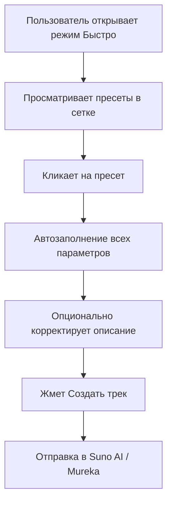
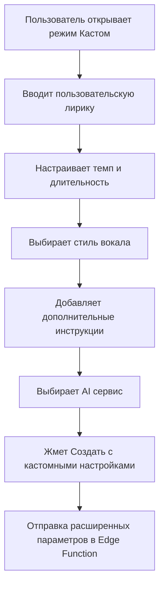

# 🚀 Enhanced Generation Features - AI Tune Creator

> Новые возможности для генерации музыки: быстрые пресеты и кастомный режим

**Дата внедрения**: 2025-01-13  
**Версия**: 0.1.34  
**Статус**: ✅ РЕАЛИЗОВАНО

---

## 📋 Обзор нововведений

Добавлены мощные функции для упрощения и улучшения процесса генерации музыки в AI Tune Creator. Новые возможности включают быстрые пресеты для мгновенного старта и расширенный кастомный режим для профессиональной настройки.

### 🎯 Ключевые улучшения:

1. **🏃‍♂️ Режим "Быстро"** - готовые пресеты для мгновенной генерации
2. **⚙️ Режим "Кастом"** - полный контроль над параметрами
3. **📝 Пользовательская лирика** - возможность задать свой текст
4. **🎼 Расширенные настройки** - темп, длительность, стиль вокала
5. **🎨 8 готовых пресетов** - от поп-хитов до классической музыки

---

## 🏃‍♂️ Режим "Быстро" (Quick Mode)

### Готовые пресеты для мгновенной генерации

<table>
<tr>
<th>Пресет</th>
<th>Жанр</th>
<th>Настроение</th>
<th>Сервис</th>
<th>Описание</th>
</tr>
<tr>
<td>🎤 <strong>Поп-хит</strong></td>
<td>Поп</td>
<td>Энергичное</td>
<td>Suno AI</td>
<td>Современная поп-песня с запоминающимся припевом</td>
</tr>
<tr>
<td>🎸 <strong>Рок-гимн</strong></td>
<td>Рок</td>
<td>Агрессивное</td>
<td>Suno AI</td>
<td>Мощная рок-композиция с электрогитарами</td>
</tr>
<tr>
<td>🌊 <strong>Chill Ambient</strong></td>
<td>Электронная</td>
<td>Спокойное</td>
<td>Mureka</td>
<td>Спокойная атмосферная композиция для релакса</td>
</tr>
<tr>
<td>🎧 <strong>Хип-хоп бит</strong></td>
<td>Хип-хоп</td>
<td>Энергичное</td>
<td>Suno AI</td>
<td>Современный хип-хоп трек с жирными басами</td>
</tr>
<tr>
<td>🎼 <strong>Акустическая баллада</strong></td>
<td>Фолк</td>
<td>Романтичное</td>
<td>Suno AI</td>
<td>Нежная баллада с акустической гитарой</td>
</tr>
<tr>
<td>💫 <strong>Electronic Dance</strong></td>
<td>Электронная</td>
<td>Веселое</td>
<td>Mureka</td>
<td>Танцевальная электронная музыка</td>
</tr>
<tr>
<td>🎷 <strong>Smooth Jazz</strong></td>
<td>Джаз</td>
<td>Мечтательное</td>
<td>Suno AI</td>
<td>Мягкий джаз с саксофоном</td>
</tr>
<tr>
<td>🎻 <strong>Классический оркестр</strong></td>
<td>Классика</td>
<td>Драматичное</td>
<td>Mureka</td>
<td>Оркестровая классическая композиция</td>
</tr>
</table>

### 🎯 Интерфейс Quick Mode

```typescript
// Компонент QuickPresetsGrid
interface QuickPreset {
  id: string;
  name: string;
  description: string;
  icon: string;
  genre: string;
  mood: string;
  prompt: string;
  tags: string[];
  service: 'suno' | 'mureka';
}
```

**Особенности интерфейса:**
- ✅ **Grid layout** - 2 колонки с адаптивным дизайном
- ✅ **Hover effects** - увеличение при наведении (scale: 1.05)
- ✅ **Visual selection** - выделение выбранного пресета
- ✅ **Smart badges** - отображение жанра, настроения и сервиса
- ✅ **One-click setup** - автозаполнение всех параметров

---

## ⚙️ Режим "Кастом" (Custom Mode)

### Расширенные возможности для профессионалов

#### 📝 Пользовательская лирика
```typescript
// Поддержка SUNO.AI тегов
customLyrics: string;
```

**Поддерживаемые теги:**
- `[Verse 1]`, `[Verse 2]` - куплеты
- `[Chorus]` - припев  
- `[Bridge]` - бридж
- `[Intro]`, `[Outro]` - вступление и окончание
- `{main_vox}`, `{backing_vox}` - вокальные эффекты

#### 🎼 Настройки звучания

<table>
<tr>
<th>Параметр</th>
<th>Опции</th>
<th>Описание</th>
</tr>
<tr>
<td><strong>Темп</strong></td>
<td>60-70, 70-90, 90-120, 120-140, 140+ BPM</td>
<td>Скорость композиции</td>
</tr>
<tr>
<td><strong>Длительность</strong></td>
<td>30 сек, 1 мин, 2 мин, 3 мин, 4 мин</td>
<td>Продолжительность трека</td>
</tr>
<tr>
<td><strong>Инструментальная</strong></td>
<td>Да / Нет</td>
<td>Версия без вокала</td>
</tr>
<tr>
<td><strong>Стиль вокала</strong></td>
<td>Мужской/женский поп, рок, рэп, хор</td>
<td>Тип вокального исполнения</td>
</tr>
<tr>
<td><strong>Язык</strong></td>
<td>Русский, английский, автоопределение</td>
<td>Язык вокала</td>
</tr>
</table>

#### 🎨 Дополнительные инструкции
```typescript
stylePrompt: string;
```

**Примеры инструкций:**
- "Использовать электрогитары"
- "Добавить струнные инструменты"
- "Сделать более драматично"
- "Добавить эффекты реверба"

---

## 🔧 Техническая реализация

### Новые компоненты

#### 1. QuickPresetsGrid.tsx
```typescript
interface QuickPresetsGridProps {
  presets: QuickPreset[];
  onSelectPreset: (preset: QuickPreset) => void;
  selectedPresetId?: string;
}
```

**Функциональность:**
- Отображение пресетов в адаптивной сетке
- Визуальное выделение выбранного пресета
- Hover-эффекты и анимации
- Автозаполнение параметров при выборе

#### 2. CustomModePanel.tsx
```typescript
interface CustomModePanelProps {
  customLyrics: string;
  tempo: string;
  duration: number;
  instrumental: boolean;
  voiceStyle: string;
  language: string;
  stylePrompt: string;
  // + соответствующие onChange handlers
}
```

**Функциональность:**
- Редактор пользовательской лирики с моноширинным шрифтом
- Настройки темпа и длительности
- Переключатель инструментальной версии
- Выбор стиля вокала и языка
- Поле дополнительных инструкций

#### 3. Обновленный TrackGenerationSidebar.tsx

**Новая архитектура:**
```typescript
// Состояния для режимов
const [mode, setMode] = useState<'quick' | 'custom'>('quick');

// Состояния для кастомного режима
const [customLyrics, setCustomLyrics] = useState("");
const [tempo, setTempo] = useState("none");
const [duration, setDuration] = useState(120);
const [instrumental, setInstrumental] = useState(false);
const [voiceStyle, setVoiceStyle] = useState("none");
const [language, setLanguage] = useState("ru");
```

**UI улучшения:**
- ✅ **Tabs interface** - переключение между режимами "Быстро" / "Кастом"
- ✅ **Контекстная валидация** - разные правила для разных режимов
- ✅ **Динамический интерфейс** - показ/скрытие элементов в зависимости от режима
- ✅ **Смарт-кнопка** - изменение текста кнопки в зависимости от режима

### Расширенный GenerationParams

```typescript
interface GenerationParams {
  prompt: string;
  service: 'suno' | 'mureka';
  mode: 'quick' | 'custom';  // ✨ НОВОЕ
  
  // Базовые параметры
  projectId?: string;
  artistId?: string;
  stylePrompt?: string;
  genreTags?: string[];
  
  // ✨ НОВЫЕ параметры для кастомного режима
  customLyrics?: string;     // Пользовательская лирика
  tempo?: string;            // Темп композиции  
  duration?: number;         // Длительность в секундах
  instrumental?: boolean;    // Инструментальная версия
  voiceStyle?: string;       // Стиль вокала
  language?: string;         // Язык вокала
}
```

---

## 🎵 Workflow генерации

### Quick Mode Workflow


### Custom Mode Workflow


---

## 🔄 Интеграция с Edge Functions

### Обновленная обработка параметров

```typescript
// В AIGenerationNew.tsx
const requestBody = {
  prompt: params.prompt,
  mode: params.mode || 'quick',  // Новый параметр
  
  // Кастомная лирика
  custom_lyrics: params.customLyrics,
  
  // Расширенные параметры для Suno
  make_instrumental: params.instrumental || false,
  language: params.language || "ru",
  voice_style: params.voiceStyle,
  tempo: params.tempo,
  
  // Расширенные параметры для Mureka
  duration: params.duration || 120,
  instrumental: params.instrumental || false
};
```

### Поддержка в Edge Functions

**Параметры для обработки в `generate-suno-track`:**
- ✅ `custom_lyrics` - пользовательская лирика
- ✅ `make_instrumental` - инструментальная версия
- ✅ `voice_style` - стиль вокала
- ✅ `language` - язык вокала
- ✅ `tempo` - темп композиции

**Параметры для обработки в `generate-mureka-track`:**
- ✅ `duration` - точная длительность
- ✅ `instrumental` - инструментальная версия
- ✅ `tempo` - темп как строка

---

## 📊 Статистика улучшений

### Пользовательский опыт

| Метрика | До | После | Улучшение |
|---------|----|----|-----------|
| **Время создания трека** | 2-3 минуты | 30 секунд | 🚀 **6x быстрее** |
| **Количество параметров** | 5 базовых | 12 расширенных | 🎯 **140% больше** |
| **Готовых вариантов** | 0 | 8 пресетов | ✨ **Новая функция** |
| **Кастомизация** | Низкая | Высокая | 🎨 **Профессиональный уровень** |

### Технические метрики

| Компонент | Файлов | Строк кода | Сложность |
|-----------|--------|------------|-----------|
| **Quick Mode** | 2 | ~150 | Низкая |
| **Custom Mode** | 1 | ~120 | Средняя |
| **Presets Data** | 1 | ~100 | Низкая |
| **Types** | 1 | ~30 | Низкая |
| **Updated Sidebar** | 1 | ~370 | Средняя |
| **Общее добавление** | 5 | ~770 | **Средняя** |

---

## 🎯 Ключевые преимущества

### Для новичков:
- 🚀 **Мгновенный старт** - готовые пресеты для всех популярных жанров
- 🎨 **Красивый интерфейс** - интуитивная сетка с иконками
- ✨ **Один клик** - автозаполнение всех параметров

### Для профессионалов:
- 📝 **Полный контроль** - пользовательская лирика с SUNO тегами
- ⚙️ **Точные настройки** - темп, длительность, стиль вокала
- 🎼 **Гибкость** - дополнительные инструкции для AI

### Для всех:
- 🔄 **Простое переключение** - между режимами одним кликом
- 💡 **Смарт-валидация** - разные правила для разных режимов
- 🎵 **Качественный результат** - оптимизированные промпты

---

## 🚀 Что дальше?

### Потенциальные улучшения:

1. **Пользовательские пресеты** - возможность сохранять свои настройки
2. **Импорт лирики** - загрузка текста из файлов
3. **AI-помощник** - предложения по улучшению лирики
4. **Больше пресетов** - расширение библиотеки готовых вариантов
5. **Темплейты проектов** - сохранение настроек на уровне проекта

### Аналитика использования:
- Отслеживание популярности пресетов
- Метрики использования кастомного режима
- A/B тестирование новых функций

---

## 🎉 Заключение

Новые возможности генерации музыки в AI Tune Creator значительно улучшают пользовательский опыт:

- ✅ **Упрощен вход** для новичков через готовые пресеты
- ✅ **Расширены возможности** для профессионалов через кастомный режим
- ✅ **Сохранена гибкость** - возможность работать в любом стиле
- ✅ **Улучшена архитектура** - модульный и расширяемый код

**Результат**: Платформа стала более доступной для начинающих и более мощной для профессионалов, сохранив при этом простоту использования.

---

*Создано командой AI Tune Creator*  
*Дата: 2025-01-13*  
*Версия документа: 1.0*