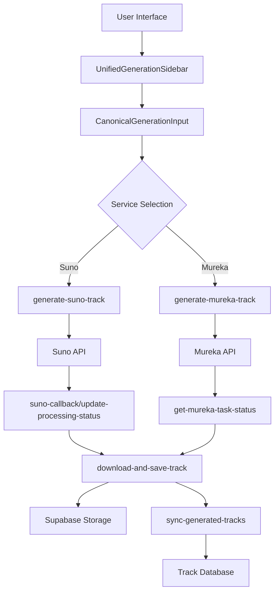

# AI Music Generation System - Complete Documentation

## Overview

This document provides comprehensive documentation for the AI music generation system, covering all user scenarios, technical implementation, and troubleshooting procedures.

## System Architecture



## User Generation Scenarios

### 1. Description-based Generation
**Flow**: User describes desired style → AI creates both music and lyrics

**Suno Example**:
```
Input: "Энергичная рок-баллада о любви и потере"
→ Suno creates complete song with vocals and lyrics
```

**Mureka Example**:
```
Input: "Ambient electronic music for meditation"
→ Mureka creates instrumental/vocal track based on description
```

### 2. Lyrics-based Generation
**Flow**: User provides ready lyrics → AI creates music to match

**Example**:
```
Input Type: lyrics
Lyrics: 
[Verse 1]
В ночи горят звезды
Как огни надежды
[Chorus]
Мы идем вперед
Сквозь тьму и страх
```

### 3. Project Context Scenarios

#### 3.1 With Project Selected
- Track is added to the selected project
- Uses project's artist and metadata
- Maintains project structure and numbering

#### 3.2 With Artist Selected (No Project)
- Creates/uses Inbox project for the selected artist
- Enables artist-specific organization without formal projects
- **NEW**: Fixed in latest version - was previously ignored

#### 3.3 Inbox Mode (No Project, No Artist)
- Uses user's default Inbox project
- Uses user's default artist profile
- Ideal for experimental generations

### 4. Model Selection

#### Suno Models:
- **Auto** (Recommended): Smart model selection
- **v3.5**: Stable, reliable generation
- **v4**: Enhanced vocal quality
- **v4.5**: Advanced features, better structure
- **v4.5+**: Premium model with best quality

#### Mureka Models:
- **Auto** (Recommended): Smart model selection  
- **V7**: Latest model with streaming support
- **O1**: Chain-of-Thought reasoning for complex requests
- **V6**: Stable baseline model

## Technical Implementation

### Language Detection
The system automatically detects input language:
```typescript
const detectLanguage = (text: string): string => {
  const russianPattern = /[а-яё]/i;
  if (russianPattern.test(text)) return 'ru';
  return 'en'; // Default to English
};
```

### Service-Specific Processing

#### Suno Processing:
1. **Request Mapping**:
   ```typescript
   {
     prompt: description,
     custom_lyrics: inputType === 'lyrics' ? lyrics : '',
     style: tags.join(', '),
     model: selectedModel,
     make_instrumental: instrumental,
     language: autoDetectedLanguage
   }
   ```

2. **Response Handling**:
   - Webhook via `suno-callback`
   - Polling via `update-processing-status`
   - Audio URL extraction from `tracks[0].audio_url`

#### Mureka Processing:
1. **Request Mapping**:
   ```typescript
   {
     lyrics: inputType === 'lyrics' ? lyrics : description,
     prompt: description,
     model: selectedModel,
     stream: false
   }
   ```

2. **Response Handling**:
   - Polling via `get-mureka-task-status`
   - Audio URL extraction from `choices[0].url`
   - Concurrency limit: 1 (sequential processing required)

### Storage and Download Process

1. **Immediate Playback**: External URL from AI provider
2. **Background Download**: `download-and-save-track` function
3. **Storage**: Supabase Storage with organized path structure
4. **Database Update**: Track record with local storage URL

### Deletion and Cleanup

**Current Issue**: Multiple sources of truth causing track resurrection
**Solution**: Unified deletion via `delete-track` edge function

```typescript
// Proper deletion flow
const deleteTrack = async (trackId: string, softDelete = true) => {
  const { data } = await supabase.functions.invoke('delete-track', {
    body: { trackId, userId: user.id, softDelete }
  });
  
  // Marks ai_generations with skip_sync: true to prevent resurrection
};
```

## Error Handling and Validation

### Critical Fixes Implemented:

1. **Mureka URL Validation**:
   ```typescript
   if (!external_url || external_url === "missing") {
     throw new Error('Invalid external_url provided');
   }
   ```

2. **Service Metadata Consistency**:
   ```typescript
   metadata: {
     ...existing,
     service: 'suno' | 'mureka',
     skip_sync: false // Controls sync behavior
   }
   ```

3. **Artist-Only Context Support**:
   ```sql
   -- Extended RPC function
   CREATE OR REPLACE FUNCTION create_or_update_track_from_generation(
     p_generation_id uuid, 
     p_project_id uuid DEFAULT NULL,
     p_artist_id uuid DEFAULT NULL -- NEW
   )
   ```

## Performance Optimizations

### Fast First Play Strategy:
1. **Immediate**: Play from external URL (Suno/Mureka servers)
2. **Background**: Download to Supabase Storage
3. **Long-term**: Serve from Supabase for reliability

### Concurrency Management:
- **Suno**: Multiple parallel requests supported
- **Mureka**: Sequential processing (concurrent_request_limit = 1)
- **Downloads**: Idempotency locks prevent duplicates

## Troubleshooting Guide

### Common Issues:

1. **"Missing" External URL**:
   - **Cause**: Incorrect URL extraction from API response
   - **Fix**: Updated extraction logic for both services
   - **Check**: Edge function logs for "external_url: missing"

2. **Track Resurrection After Deletion**:
   - **Cause**: `sync-generated-tracks` recreating deleted tracks
   - **Fix**: Mark `ai_generations` with `skip_sync: true`
   - **Check**: Database `metadata` field for sync flags

3. **Artist Selection Ignored**:
   - **Cause**: RPC function only handled `project_id`
   - **Fix**: Extended RPC to support `artist_id` parameter
   - **Check**: Tracks appear in correct artist's Inbox

### Monitoring Commands:

```sql
-- Check for problematic generations
SELECT id, service, status, metadata->>'skip_sync' as skip_sync
FROM ai_generations 
WHERE status = 'completed' 
  AND result_url IS NULL
  AND metadata->>'skip_sync' IS DISTINCT FROM 'true';

-- Check download failures
SELECT generation_id, external_url, created_at
FROM activity_logs 
WHERE action = 'download_failed'
  AND created_at > NOW() - INTERVAL '1 day';
```

## API Integration Details

### Edge Functions:

1. **generate-suno-track**: Handles Suno API integration
2. **generate-mureka-track**: Handles Mureka API integration  
3. **download-and-save-track**: Unified download and storage
4. **sync-generated-tracks**: Synchronizes completions to tracks
5. **delete-track**: Proper deletion with storage cleanup

### Database Functions:

1. **create_or_update_track_from_generation**: Atomic track creation
2. **ensure_user_inbox**: Creates user's default inbox
3. **dedupe_track_title**: Prevents duplicate track names

## Status Codes and States

### Generation Statuses:
- `pending`: Initial state, not yet processed
- `processing`: Being generated by AI service
- `completed`: Successfully generated
- `failed`: Generation failed
- `cancelled`: User cancelled

### Track Statuses:
- `external`: Playing from provider URL
- `downloading`: Being saved to storage
- `stored`: Available in Supabase Storage
- `failed`: Download/storage failed

## Future Enhancements

1. **Multi-track Generation**: Handle multiple tracks per generation
2. **Version Management**: Track variants and versions
3. **Collaborative Features**: Shared projects and tracks
4. **Advanced Analytics**: Generation success rates and performance metrics

## Testing Checklist

### Suno Testing:
- [ ] Description generation with auto language detection
- [ ] Lyrics generation with Russian/English text
- [ ] Model selection (v3.5, v4, v4.5, v4.5+)
- [ ] Project context (with/without project/artist)
- [ ] Instrumental mode toggle

### Mureka Testing:
- [ ] Description generation with various styles
- [ ] Lyrics generation with custom text
- [ ] Model selection (V7, O1, V6)
- [ ] Sequential processing (no concurrent requests)
- [ ] Proper URL extraction from `choices[0].url`

### Deletion Testing:
- [ ] Soft delete marks tracks as deleted
- [ ] Hard delete removes from storage
- [ ] No track resurrection after deletion
- [ ] Proper cleanup of associated files

### Performance Testing:
- [ ] First play starts immediately from external URL
- [ ] Background download completes without errors
- [ ] Storage URLs work after download completion
- [ ] No duplicate downloads or lock conflicts

---

*Last Updated: January 2025*
*Version: 2.0.0 - Comprehensive System Overhaul*