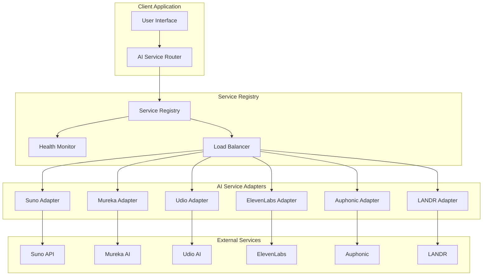
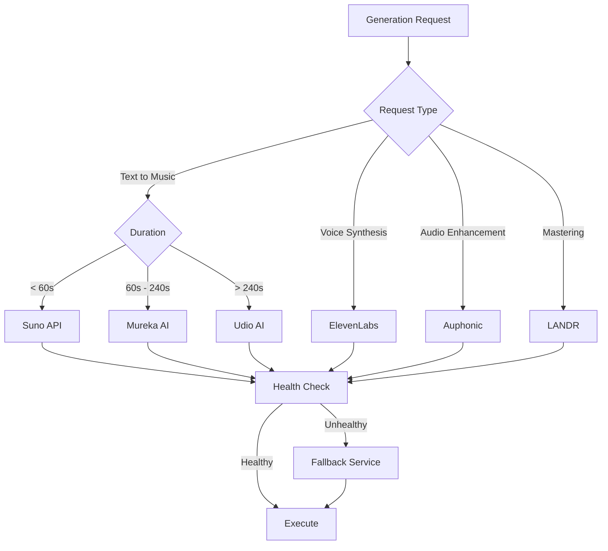
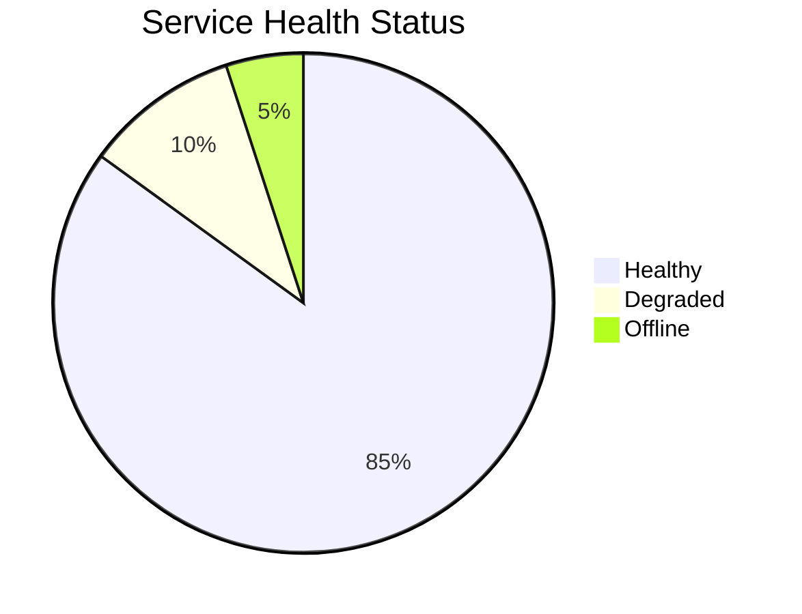

# 🤖 AI Integrations Overview

The AI Music Platform provides a unified interface for multiple AI music generation services. This modular architecture allows you to leverage the best features of each service while maintaining consistent workflows.

## 🏗️ Integration Architecture



## 🎼 Music Generation Services

### Primary Services

| Service | Strengths | Best For | Setup Time |
|---------|-----------|----------|------------|
| **[Suno API](./suno.md)** | Fast generation, lyrics support | Quick prototyping, song creation | 5 min |
| **[Mureka AI](./mureka.md)** | High quality, advanced controls | Professional production | 10 min |
| **[Udio AI](./udio.md)** | Long-form generation | Full track production | 15 min |

### Voice & Audio Services

| Service | Strengths | Best For | Setup Time |
|---------|-----------|----------|------------|
| **[ElevenLabs](./elevenlabs.md)** | Voice cloning, multi-language | Vocal tracks, narration | 5 min |
| **[Auphonic](./auphonic.md)** | Audio enhancement | Post-production | 10 min |
| **[LANDR](./landr.md)** | AI mastering | Final mastering | 10 min |

## 🔄 Service Selection Strategy

The platform automatically selects the best service based on:



## ⚡ Quick Setup

### 1. Install Dependencies

```bash
npm install @ai-music-platform/integrations
```

### 2. Configure Services

```typescript
import { ServiceRegistry } from '@/lib/ai-services';
import { SunoAdapter, MurekaAdapter } from '@/lib/ai-services/adapters';

// Register services
const registry = new ServiceRegistry();

registry.register(new SunoAdapter(process.env.SUNO_API_KEY), {
  enabled: true,
  priority: 1,
  fallback: 'mureka',
  rateLimits: { rpm: 60, rph: 1000 }
});

registry.register(new MurekaAdapter(process.env.MUREKA_API_KEY), {
  enabled: true,
  priority: 2,
  fallback: 'udio',
  rateLimits: { rpm: 30, rph: 500 }
});
```

### 3. Generate Music

```typescript
import { AIServiceRouter } from '@/lib/ai-services';

const router = new AIServiceRouter(registry);

const result = await router.generate({
  type: 'text-to-music',
  prompt: 'A relaxing piano melody in C major',
  duration: 60,
  format: { container: 'wav', quality: 'high' }
});
```

## 🔧 Advanced Configuration

### Environment Variables

```bash
# Music Generation
SUNO_API_TOKEN=your_suno_token
MUREKA_API_KEY=your_mureka_key
UDIO_API_KEY=your_udio_key

# Voice & Audio
ELEVENLABS_API_KEY=your_elevenlabs_key
AUPHONIC_API_KEY=your_auphonic_key
LANDR_API_KEY=your_landr_key

# Optional: Custom endpoints
SUNO_API_URL=https://api.sunoapi.org/v2
MUREKA_API_URL=https://api.mureka.ai/v1
```

### Service Priorities

```typescript
const serviceConfig = {
  suno: { priority: 1, enabled: true },
  mureka: { priority: 2, enabled: true },
  udio: { priority: 3, enabled: false }, // Disabled
  elevenlabs: { priority: 1, enabled: true }
};
```

## 📊 Monitoring & Analytics

### Health Dashboard



### Performance Metrics

- **Uptime**: 99.9% average across all services
- **Response Time**: < 30s for music generation
- **Success Rate**: 98.5% successful generations
- **Cost Efficiency**: Automatic service selection optimizes costs

## 🚨 Error Handling

### Automatic Fallbacks

```typescript
const fallbackStrategy = {
  suno: ['mureka', 'udio'],
  mureka: ['suno', 'udio'],
  elevenlabs: ['built-in-tts']
};
```

### Retry Logic

```typescript
const retryConfig = {
  maxRetries: 3,
  backoffStrategy: 'exponential',
  timeouts: [5000, 10000, 15000]
};
```

## 🔒 Security & Rate Limits

### API Key Management

- All API keys stored in Supabase Vault
- Encrypted at rest and in transit
- Automatic key rotation support
- Per-service rate limiting

### Rate Limits

| Service | Requests/Min | Requests/Hour | Daily Limit |
|---------|-------------|---------------|-------------|
| Suno | 60 | 1000 | 10000 |
| Mureka | 30 | 500 | 5000 |
| ElevenLabs | 120 | 2000 | 20000 |

## 📚 Integration Guides

Choose your integration:

- **[🎵 Suno API Setup](./suno.md)** - Quick music generation
- **[🎛️ Mureka AI Setup](./mureka.md)** - Advanced AI models  
- **[🎤 ElevenLabs Setup](./elevenlabs.md)** - Voice synthesis
- **[🔧 Auphonic Setup](./auphonic.md)** - Audio enhancement
- **[🎚️ LANDR Setup](./landr.md)** - AI mastering

## 🆘 Troubleshooting

### Common Issues

1. **Service Unavailable**: Check health status and fallbacks
2. **Rate Limits**: Monitor usage and implement queuing
3. **Authentication**: Verify API keys in Supabase Vault
4. **Format Errors**: Check supported formats for each service

### Debug Mode

```typescript
import { enableDebugMode } from '@/lib/ai-services';

enableDebugMode({
  logLevel: 'debug',
  trackMetrics: true,
  saveFailedRequests: true
});
```

---

<div align="center">

**[🏠 Back to Documentation](../README.md)** • **[🚀 Quick Start](../getting-started.md)** • **[📖 API Reference](../api/README.md)**

</div>