# 🎵 Suno API Integration Guide

Suno API is a powerful text-to-music generation service that creates high-quality audio from text prompts. This guide covers setup, configuration, and best practices for integrating Suno into your AI Music Platform.

## 🚀 Quick Setup

### 1. Get API Access

1. Visit [sunoapi.org](https://sunoapi.org)
2. Create an account and verify email
3. Navigate to API settings
4. Generate your API token

### 2. Configure in Supabase

```bash
# Add your Suno API token to Supabase secrets
npx supabase secrets set SUNO_API_TOKEN=your_token_here
npx supabase secrets set SUNOAPI_ORG_TOKEN=your_org_token_here
```

### 3. Test Connection

```typescript
import { SunoAdapter } from '@/lib/ai-services/adapters';

const suno = new SunoAdapter(process.env.SUNO_API_TOKEN);
const isAvailable = await suno.isAvailable();
console.log('Suno API available:', isAvailable);
```

## 🎛️ Configuration Options

### Service Configuration

```typescript
const sunoConfig = {
  enabled: true,
  priority: 1,
  fallback: 'mureka',
  rateLimits: {
    rpm: 60,      // Requests per minute
    rph: 1000,    // Requests per hour
    daily: 10000  // Daily limit
  },
  features: ['text-to-music', 'style-transfer'],
  pricing: {
    costPerGeneration: 0.12,
    currency: 'USD'
  }
};
```

### Generation Parameters

```typescript
interface SunoGenerationRequest {
  prompt: string;              // Text description
  style?: string;             // Musical style/genre
  duration?: number;          // Duration in seconds (10-240)
  format?: 'mp3' | 'wav';     // Output format
  quality?: 'low' | 'medium' | 'high';
  options?: {
    instrumental?: boolean;    // Instrumental only
    voice_style?: string;     // Voice characteristics
    tempo?: number;           // BPM (60-200)
    key?: string;             // Musical key
  };
}
```

## 🎼 Usage Examples

### Basic Text-to-Music

```typescript
import { serviceRegistry, AIServiceRouter } from '@/lib/ai-services';

const router = new AIServiceRouter(serviceRegistry);

const result = await router.generate({
  type: 'text-to-music',
  prompt: 'A relaxing acoustic guitar melody with soft vocals about a peaceful morning',
  duration: 60,
  format: { container: 'mp3', quality: 'high' }
});

console.log('Generation ID:', result.id);
console.log('Estimated completion:', result.estimatedCompletion);
```

### Advanced Generation with Styles

```typescript
const advancedRequest = {
  type: 'text-to-music' as const,
  prompt: 'Upbeat electronic dance music with synthesizers',
  style: 'EDM, House, 128 BPM',
  duration: 120,
  format: { container: 'wav', quality: 'high' },
  options: {
    instrumental: false,
    voice_style: 'energetic female vocals',
    tempo: 128,
    key: 'F# minor'
  }
};

const result = await router.generate(advancedRequest);
```

### Monitoring Generation Progress

```typescript
const checkProgress = async (generationId: string) => {
  const status = await router.getStatus(generationId);
  
  switch (status.status) {
    case 'pending':
      console.log('Generation queued...');
      break;
    case 'processing':
      console.log(`Processing... ${status.progress}% complete`);
      break;
    case 'completed':
      console.log('Generation completed!');
      console.log('Download URL:', status.audioUrl);
      break;
    case 'failed':
      console.error('Generation failed:', status.error);
      break;
  }
  
  return status;
};

// Poll for completion
const pollStatus = async (generationId: string) => {
  let status = await checkProgress(generationId);
  
  while (status.status === 'pending' || status.status === 'processing') {
    await new Promise(resolve => setTimeout(resolve, 5000));
    status = await checkProgress(generationId);
  }
  
  return status;
};
```

## 🎨 Style Prompting Best Practices

### Effective Prompt Structure

```typescript
const effectivePrompts = {
  // Good: Specific and descriptive
  good: "Melancholic indie folk song with acoustic guitar fingerpicking, gentle male vocals, and subtle string arrangements in D major",
  
  // Better: Include emotional context
  better: "A nostalgic indie folk ballad capturing the feeling of autumn evenings, featuring warm acoustic guitar, contemplative male vocals, and soft cello",
  
  // Best: Complete musical direction
  best: "Nostalgic indie folk ballad in D major, 70 BPM, fingerpicked acoustic guitar foundation, contemplative male vocals with slight reverb, subtle cello and violin harmonies, capturing the melancholy of autumn evenings and memories of home"
};
```

### Genre-Specific Prompts

```typescript
const genrePrompts = {
  jazz: "Smooth jazz with piano, upright bass, and brushed drums in Bb major",
  classical: "Romantic piano sonata in the style of Chopin, emotional and expressive",
  electronic: "Ambient electronic with synthesized pads, soft beats, and ethereal textures",
  rock: "Alternative rock with distorted guitars, driving bass, and powerful drums",
  folk: "Traditional folk with acoustic guitar, harmonica, and storytelling vocals",
  pop: "Upbeat pop with catchy melody, modern production, and radio-friendly structure"
};
```

## 📊 Monitoring & Analytics

### Generation Metrics

```typescript
interface SunoMetrics {
  successRate: number;        // Percentage of successful generations
  avgGenerationTime: number;  // Average time in seconds
  avgCostPerGeneration: number;
  qualityScore: number;       // User rating average
  popularGenres: string[];    // Most requested genres
  peakUsageHours: number[];   // Busy hours
}

const getMetrics = async (): Promise<SunoMetrics> => {
  const adapter = serviceRegistry.getService('suno');
  return await adapter?.provider.getMetrics();
};
```

### Real-time Status Dashboard

```mermaid
graph TB
    A[Suno API Status] --> B[Health Check]
    B --> C{Status}
    C -->|Healthy| D[✅ Operational]
    C -->|Degraded| E[⚠️ Degraded Performance]
    C -->|Down| F[❌ Service Unavailable]
    
    D --> G[Current Queue: 0]
    E --> H[Current Queue: 25]
    F --> I[Fallback to Mureka]
    
    G --> J[Avg Response: 25s]
    H --> K[Avg Response: 45s]
    I --> L[Redirecting requests...]
```



## 🔧 Error Handling

### Common Error Scenarios

```typescript
const handleSunoErrors = (error: Error) => {
  if (error.message.includes('Rate limit exceeded')) {
    // Wait and retry with exponential backoff
    return handleRateLimit();
  }
  
  if (error.message.includes('Authentication failed')) {
    // Check API key validity
    return handleAuthError();
  }
  
  if (error.message.includes('Invalid prompt')) {
    // Suggest prompt improvements
    return handlePromptError();
  }
  
  if (error.message.includes('Service unavailable')) {
    // Switch to fallback service
    return handleServiceDown();
  }
};
```

### Automatic Retry Logic

```typescript
const generateWithRetry = async (request: GenerationRequest, maxRetries = 3) => {
  for (let attempt = 1; attempt <= maxRetries; attempt++) {
    try {
      return await router.generate(request);
    } catch (error) {
      if (attempt === maxRetries) throw error;
      
      const delay = Math.pow(2, attempt) * 1000; // Exponential backoff
      await new Promise(resolve => setTimeout(resolve, delay));
    }
  }
};
```

## 💰 Cost Optimization

### Pricing Structure

| Quality | Duration | Cost (USD) | Best For |
|---------|----------|------------|----------|
| Low | 30s | $0.08 | Previews, demos |
| Medium | 30s | $0.12 | Standard quality |
| High | 30s | $0.18 | Professional use |
| High | 60s | $0.24 | Extended tracks |
| High | 120s | $0.36 | Full songs |

### Cost-Effective Strategies

```typescript
const optimizeCosts = {
  // Use previews for iteration
  usePreviewMode: {
    duration: 15,
    quality: 'medium',
    purpose: 'concept validation'
  },
  
  // Batch similar requests
  batchGeneration: {
    groupByStyle: true,
    groupByDuration: true,
    maxBatchSize: 5
  },
  
  // Cache successful generations
  enableCaching: {
    similarPrompts: true,
    styleVariations: true,
    duration: '24h'
  }
};
```

## 🔒 Security Best Practices

### API Key Management

```typescript
// ✅ Secure: Use environment variables
const apiKey = process.env.SUNO_API_TOKEN;

// ❌ Insecure: Never hardcode keys
// const apiKey = "sk-1234567890abcdef";

// ✅ Validate key format
const validateApiKey = (key: string): boolean => {
  return /^sk-[a-zA-Z0-9]{20,}$/.test(key);
};
```

### Request Validation

```typescript
const validateRequest = (request: GenerationRequest): boolean => {
  // Check prompt length
  if (request.prompt.length > 500) {
    throw new Error('Prompt too long (max 500 characters)');
  }
  
  // Validate duration
  if (request.duration && (request.duration < 10 || request.duration > 240)) {
    throw new Error('Duration must be between 10-240 seconds');
  }
  
  // Content filtering
  if (containsInappropriateContent(request.prompt)) {
    throw new Error('Prompt contains inappropriate content');
  }
  
  return true;
};
```

## 📚 Advanced Features

### Custom Voice Styles

```typescript
const voiceStyles = {
  male: ['deep', 'warm', 'raspy', 'smooth', 'powerful'],
  female: ['sweet', 'sultry', 'bright', 'rich', 'ethereal'],
  neutral: ['robotic', 'whispered', 'choir', 'spoken-word']
};

const generateWithVoice = async (prompt: string, voiceStyle: string) => {
  return await router.generate({
    type: 'text-to-music',
    prompt: `${prompt} with ${voiceStyle} vocals`,
    options: { voice_style: voiceStyle }
  });
};
```

### Style Transfer

```typescript
const transferStyle = async (sourceTrack: string, targetStyle: string) => {
  return await router.generate({
    type: 'style-transfer',
    prompt: `Transform this track to ${targetStyle} style`,
    options: {
      source_audio_url: sourceTrack,
      target_style: targetStyle,
      preserve_vocals: true
    }
  });
};
```

## 🐛 Troubleshooting

### Common Issues

| Issue | Cause | Solution |
|-------|-------|----------|
| "Invalid API key" | Wrong or expired key | Check Supabase secrets |
| "Rate limit exceeded" | Too many requests | Implement exponential backoff |
| "Prompt rejected" | Content filter triggered | Refine prompt language |
| "Generation timeout" | Server overload | Retry with fallback service |

### Debug Mode

```typescript
// Enable detailed logging
process.env.SUNO_DEBUG = 'true';

// Log all requests and responses
const debugSuno = new SunoAdapter(apiKey, { debug: true });
```

### Health Monitoring

```typescript
const monitorHealth = async () => {
  const adapter = serviceRegistry.getService('suno');
  const metrics = await adapter?.provider.getMetrics();
  
  if (metrics.successRate < 95) {
    console.warn('Suno success rate dropping:', metrics.successRate);
    // Switch to fallback or alert administrators
  }
};

// Run health check every minute
setInterval(monitorHealth, 60000);
```

## 📈 Performance Optimization

### Caching Strategy

```typescript
import { Redis } from 'ioredis';

const cache = new Redis(process.env.REDIS_URL);

const getCachedGeneration = async (promptHash: string) => {
  const cached = await cache.get(`suno:${promptHash}`);
  return cached ? JSON.parse(cached) : null;
};

const cacheGeneration = async (promptHash: string, result: any) => {
  await cache.setex(`suno:${promptHash}`, 3600, JSON.stringify(result));
};
```

### Queue Management

```typescript
class SunoQueue {
  private queue: GenerationRequest[] = [];
  private processing = false;
  
  async add(request: GenerationRequest): Promise<string> {
    this.queue.push(request);
    this.processQueue();
    return request.id;
  }
  
  private async processQueue(): Promise<void> {
    if (this.processing || this.queue.length === 0) return;
    
    this.processing = true;
    
    while (this.queue.length > 0) {
      const request = this.queue.shift();
      await this.processRequest(request);
      
      // Rate limiting delay
      await new Promise(resolve => setTimeout(resolve, 1000));
    }
    
    this.processing = false;
  }
}
```

---

<div align="center">

**[🏠 Back to Integrations](./README.md)** • **[🎛️ Mureka Setup](./mureka.md)** • **[🎤 ElevenLabs Setup](./elevenlabs.md)**

</div>