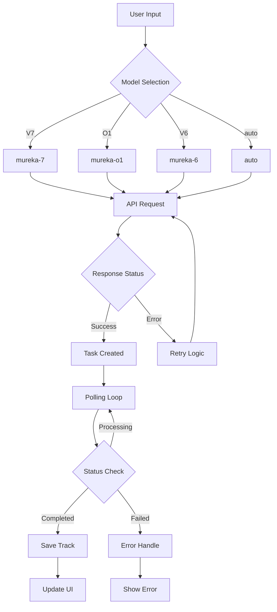

# Mureka AI Integration Guide

## 🎵 Overview

This guide covers the complete Mureka AI integration for music generation, including API usage, model selection, and troubleshooting.

## 📋 API Configuration

### Environment Variables
```bash
MUREKA_API_KEY=your_mureka_api_key_here
MUREKA_API_URL=https://api.mureka.ai/v1
```

### Supported Models

| UI Model | API Model | Description |
|----------|-----------|-------------|
| `auto` | `auto` | Automatic model selection |
| `V7` | `mureka-7` | Latest Mureka V7 model |
| `O1` | `mureka-o1` | Chain-of-Thought model |
| `V6` | `mureka-6` | Stable V6 model |

## 🔄 Generation Process Flow



## 🛠️ API Endpoints

### Generate Song
```
POST https://api.mureka.ai/v1/song/generate
```

**Request Body:**
```json
{
  "lyrics": "song lyrics or generation prompt",
  "model": "mureka-7", // mapped from UI
  "prompt": "style and mood description",
  "stream": false
}
```

### Query Status
```
GET https://api.mureka.ai/v1/song/query/{taskId}
```

## 🎯 Key Features

### Model Mapping
- **UI Layer**: Uses friendly names (V7, O1, V6, auto)
- **API Layer**: Maps to official API names (mureka-7, mureka-o1, mureka-6, auto)
- **Validation**: Prevents invalid model errors

### Content Processing
- **Lyrics Detection**: Automatically detects if input contains structured lyrics
- **Prompt Generation**: Converts descriptions to generation prompts
- **Style Integration**: Combines genre, mood, and tempo into coherent prompts

### Error Handling
- **Retry Logic**: Exponential backoff for temporary failures
- **Rate Limiting**: 10 requests per 10-minute window
- **Model Validation**: Prevents unsupported model errors

## 🔍 Troubleshooting

### Common Issues

#### 1. "non-2xx status from Mureka API"
**Cause**: Model name mismatch between UI and API
**Solution**: Check model mapping in edge function

#### 2. Model not being passed to API
**Cause**: Model parameter not included in request body
**Solution**: Ensure `params.model` is passed in `useTrackGenerationWithProgress`

#### 3. Invalid model error
**Cause**: UI model not mapped to valid API model
**Solution**: Use MODEL_MAPPING in edge function

### Debugging Steps

1. **Check Console Logs**:
   ```
   [MODEL] UI модель: V7 -> API модель: mureka-7
   [API] Получен ответ со статусом: 200
   ```

2. **Verify Model Selection**:
   - UI shows correct model in dropdown
   - Model passed to edge function
   - Model mapped correctly in API request

3. **Check API Response**:
   - 200 status indicates success
   - Task ID returned for polling
   - No authentication errors

## 📊 Rate Limits & Constraints

- **Rate Limit**: 10 requests per 10 minutes per user
- **Duration**: 10-480 seconds
- **Text Limits**: 
  - Prompt: 2000 characters
  - Lyrics: 5000 characters
- **Polling**: Max 100 attempts (5 minutes timeout)

## 🎨 UI Integration

### Model Selection Component
```typescript
<Select value={model} onValueChange={setModel}>
  <SelectItem value="auto">Auto (Рекомендуемая)</SelectItem>
  <SelectItem value="V7">Mureka V7 (Новейшая)</SelectItem>
  <SelectItem value="O1">Mureka O1 (Chain-of-Thought)</SelectItem>
  <SelectItem value="V6">Mureka V6 (Стабильная)</SelectItem>
</Select>
```

### Generation Parameters
```typescript
interface GenerationParams {
  prompt: string;
  service: 'mureka';
  model: 'auto' | 'V7' | 'O1' | 'V6';
  customLyrics?: string;
  instrumental?: boolean;
  duration?: number; // 10-480 seconds
  language?: string;
}
```

## 🔐 Security Considerations

- API keys stored in Supabase secrets
- User-specific rate limiting
- Input validation and sanitization
- Authenticated requests only

## 📈 Performance Optimization

- **Parallel Processing**: Multiple tracks saved simultaneously
- **Efficient Polling**: 3-second intervals with timeout
- **Caching**: Rate limit data cached in memory
- **Error Recovery**: Automatic retry with backoff

## 🚀 Future Enhancements

- [ ] Streaming support
- [ ] Advanced model parameters
- [ ] Batch generation
- [ ] Real-time status updates via WebSockets
- [ ] Custom voice synthesis