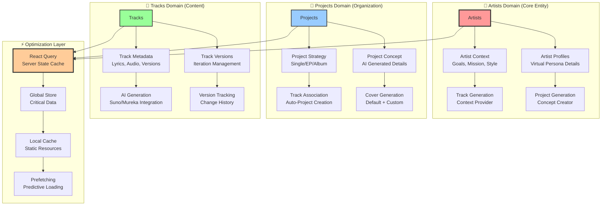
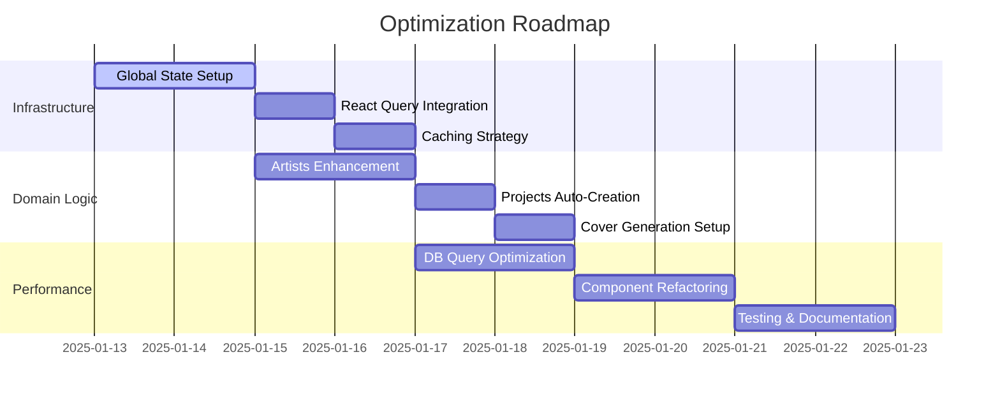

# 📊 Комплексный план оптимизации AI Music Platform

> **Версия**: 0.01.032-planning  
> **Дата**: 2025-01-13  
> **Цель**: Создание высокопроизводительной архитектуры с минимальными запросами к БД

## 🎯 Стратегические цели

### 📈 Производительность
- **Сокращение DB запросов на 80%** через многоуровневое кеширование
- **Мгновенная навигация** между страницами с prefetching
- **Offline-ready** интерфейс для критических данных
- **Optimistic UI** для лучшего пользовательского опыта

### 🏗️ Архитектура
- **Централизованный State Management** для глобальных данных
- **React Query** для серверного состояния с умным кешированием
- **Component Splitting** - файлы ≤300 строк с четким разделением ответственности
- **Domain-Driven Design** с фокусом на Artists как главной сущности

## 🎨 Архитектурная модель



## 📋 Детальный план задач

### Phase 1: 🏗️ Архитектурный фундамент


### 🎯 Task Breakdown

#### 🏗️ **T-001: Глобальный State Management**
```typescript
/**
 * TODO: Создать централизованную систему управления состоянием
 * 
 * PRIORITY: CRITICAL
 * COMPLEXITY: HIGH
 * IMPACT: MAJOR
 * 
 * Компоненты:
 * - AppDataProvider (React Context)
 * - useAppData hook
 * - Persistent storage sync
 * - State hydration/dehydration
 */
```

#### ⚡ **T-002: React Query Hooks**
```typescript
/**
 * TODO: Внедрить React Query для всех серверных запросов
 * 
 * PRIORITY: CRITICAL
 * COMPLEXITY: MEDIUM
 * IMPACT: MAJOR
 * 
 * Хуки для создания:
 * - useArtists() - основные данные артистов
 * - useProjects() - проекты пользователя
 * - useTracks() - треки с версионированием
 * - useGenerations() - история AI генераций
 */
```

#### 🎨 **T-003: Artists Domain Enhancement**
```typescript
/**
 * TODO: Расширить модель Artists как центральной сущности
 * 
 * PRIORITY: HIGH
 * COMPLEXITY: MEDIUM
 * IMPACT: MAJOR
 * 
 * Улучшения:
 * - Детальный профиль (миссия, цели, стиль)
 * - Context provider для генерации
 * - AI Integration для создания persona
 * - Validation layer
 */
```

#### 🖼️ **T-004: Cover Generation System**
```typescript
/**
 * TODO: Настроить систему генерации обложек
 * 
 * PRIORITY: MEDIUM  
 * COMPLEXITY: MEDIUM
 * IMPACT: MEDIUM
 * 
 * Функционал:
 * - Default generation via SunoAPI.org
 * - Custom prompt interface
 * - Multi-provider support (Stability, DALL-E, Midjourney)
 * - Preview & regeneration system
 */
```

## 🔄 Реализуемые паттерны

### 🎯 **Smart Caching Strategy**
```typescript
/**
 * Трехуровневая система кеширования:
 * 
 * Level 1: React Query (Server State)
 * - 5 минут staleTime для базовых данных
 * - 30 минут cacheTime
 * - Background refetching
 * 
 * Level 2: Global Context (Critical Data)  
 * - Artists, Projects списки
 * - User preferences
 * - Navigation state
 * 
 * Level 3: localStorage (Static Resources)
 * - Genre/mood options
 * - UI preferences  
 * - Draft data persistence
 */
```

### 🚀 **Optimistic Updates Pattern**
```typescript
/**
 * Мгновенный UI feedback:
 * 
 * 1. User Action → Immediate UI Update
 * 2. Background API Call → Server Sync
 * 3. Error Handling → Rollback if needed
 * 4. Success → Persistent State Update
 */
```

### 🔧 **Component Architecture**
```typescript
/**
 * Принцип разделения файлов ≤300 строк:
 * 
 * 1. Container Components (логика + state)
 * 2. Presentation Components (UI only)
 * 3. Custom Hooks (бизнес логика)
 * 4. Utility Functions (pure functions)
 * 5. Type Definitions (отдельные файлы)
 */
```

## 📚 Документационная стратегия

### 📝 **Documentation Standards**
```typescript
/**
 * Обязательные элементы в каждом файле:
 * 
 * @fileoverview - Описание назначения файла
 * @version - Версия и дата последнего изменения  
 * @author - Responsible developer
 * @see - Ссылки на связанную документацию
 * 
 * TODO: - Планируемые улучшения
 * FIXME: - Известные проблемы требующие исправления
 * HACK: - Временные решения
 * NOTE: - Важные комментарии для понимания
 */
```

### 🔗 **Cross-Reference System**
- `README.md` → главный hub с ссылками на все документы
- `docs/` → специализированная документация с Mermaid диаграммами
- Inline comments → ссылки на соответствующие разделы документации
- Component headers → связи с архитектурными решениями

## 🎯 Метрики успеха

### ⏱️ **Performance Metrics**
- **DB Queries**: <5 на страницу (сейчас 15-20)
- **First Load Time**: <2 секунды  
- **Navigation Speed**: <200ms между страницами
- **Cache Hit Rate**: >80% для повторных запросов

### 🏗️ **Architecture Metrics**  
- **Max File Size**: ≤300 строк (принудительно)
- **Component Cohesion**: >90% single responsibility
- **Documentation Coverage**: 100% public APIs
- **Type Safety**: 100% TypeScript coverage

### 🚀 **User Experience Metrics**
- **Offline Functionality**: базовая навигация работает без сети
- **Optimistic Updates**: мгновенный UI feedback
- **Error Recovery**: graceful fallbacks для всех сценариев
- **Loading States**: информативные индикаторы прогресса

---

> **Next Action**: Начинаем реализацию с создания глобального AppDataProvider и основных React Query хуков для централизованного управления состоянием.

**Автор**: Claude Code Assistant  
**Связанные документы**: 
- [Architecture Overview](../CLAUDE.md#architecture--tech-stack)
- [Database Schema](../CLAUDE.md#database-schema)  
- [Performance Issues](../CLAUDE.md#известные-проблемы-и-оптимизации)