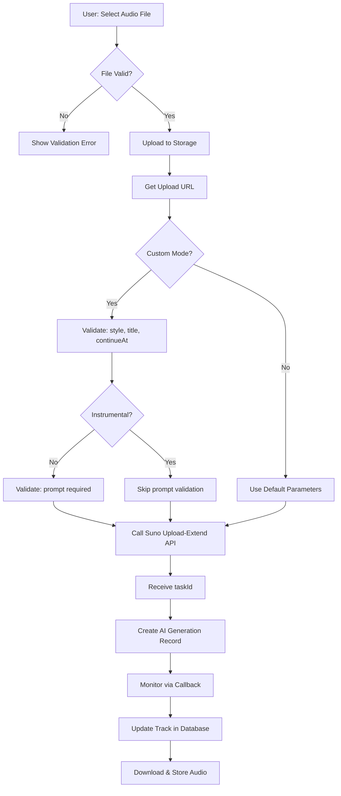

# Suno API Integration v2.0
## Аудит и модернизация интеграции с Suno API v1

*Версия: 0.01.037*  
*Дата обновления: 17.08.2025*

## 🎯 Обзор изменений

Данный документ описывает модернизацию интеграции с Suno API для соответствия актуальной спецификации v1 и добавления новых возможностей.

### Ключевые улучшения:
- ✅ Исправлена валидация для `upload-extend` API
- ✅ Устранена ошибка `undefined projectId` в callback
- ✅ Добавлена поддержка Timestamped Lyrics
- 🚧 Подготовка к Cover Generation
- 🚧 Обновление SunoAdapter под v1 API

## 📋 Детализированный план работ

### Phase 1: Backend исправления ✅

#### 1.1 Исправление upload-extend-suno-track
**Проблема**: Недостаточная валидация обязательных параметров согласно Suno API docs.

**Решение**:
```typescript
// Новая валидация для custom mode
if (defaultParamFlag) {
  if (!style || !title) {
    return error('style and title are required when defaultParamFlag is true');
  }
  
  if (!instrumental && !prompt) {
    return error('prompt is required when defaultParamFlag is true and instrumental is false');
  }
  
  if (!continueAt) {
    return error('continueAt is required when defaultParamFlag is true');
  }
}
```

#### 1.2 Исправление suno-callback
**Проблема**: `projectId` не определен в области видимости.

**Решение**:
```typescript
// Получаем projectId из metadata генерации
const projectId = generation.metadata?.project_id;
```

#### 1.3 Новая Edge Function: get-suno-timestamped-lyrics ✅
**Назначение**: Получение лирики с временными метками для синхронизации с аудио.

**Эндпоинт**: `/functions/v1/get-suno-timestamped-lyrics`

**Параметры**:
- `taskId` (required): ID задачи генерации
- `audioId` (optional): Конкретный ID аудио
- `musicIndex` (optional): Индекс трека (0 или 1)

**Ответ**:
```typescript
interface TimestampedLyricsResponse {
  alignedWords: AlignedWord[];
  waveformData: number[];
  hootCer: number;
  isStreamed: boolean;
}
```

### Phase 2: Frontend интеграция 🚧

#### 2.1 Валидация в UI компонентах
- Добавить проверки в формы генерации
- Показывать подсказки по обязательным полям
- Валидация файлов (формат, длительность)

#### 2.2 Интеграция новых возможностей
- Компонент для отображения Timestamped Lyrics
- Улучшенная обработка Upload & Extend
- Подготовка к Cover Generation

#### 2.3 Обновление терминологии
- "Расширить аудио" → "Upload & Extend"
- Добавить описания новых возможностей
- Обновить подсказки в UI

### Phase 3: Архитектурные улучшения 🔄

#### 3.1 Обновление SunoAdapter
```typescript
// Текущие проблемы:
- baseUrl: 'https://api.sunoapi.org/v2' // Неверная версия!
- Методы не соответствуют v1 API

// Решение:
- baseUrl: 'https://api.sunoapi.org'
- Методы под v1 endpoints
```

#### 3.2 Типизация
```typescript
// Новые типы для v1 API
interface SunoUploadExtendRequest {
  uploadUrl: string;
  defaultParamFlag: boolean;
  instrumental?: boolean;
  continueAt?: number;
  prompt?: string;
  style?: string;
  title?: string;
  model: 'V3_5' | 'V4' | 'V4_5' | 'V4_5PLUS';
  callBackUrl: string;
}
```

## 🔄 Диаграмма потока Upload & Extend



## 📊 API Endpoints Mapping

| Функция | Наш Endpoint | Suno API | Статус |
|---------|-------------|----------|--------|
| Basic Generation | `/functions/v1/generate-suno-track` | `/api/v1/generate/music` | ✅ Работает |
| Upload & Extend | `/functions/v1/upload-extend-suno-track` | `/api/v1/generate/upload-extend` | ✅ Исправлено |
| Extend Existing | `/functions/v1/extend-suno-track` | `/api/v1/generate/extend` | ✅ Работает |
| Get Status | `/functions/v1/get-suno-record-info` | `/api/v1/generate/record-info` | ✅ Работает |
| Timestamped Lyrics | `/functions/v1/get-suno-timestamped-lyrics` | `/api/v1/generate/get-timestamped-lyrics` | ✅ Добавлено |
| Cover Generation | `/functions/v1/generate-suno-cover` | `/api/v1/suno/cover/generate` | 🚧 TODO |
| Style Boost | `/functions/v1/boost-suno-style` | `/api/v1/style/generate` | ✅ Работает |

## 🔐 Безопасность и валидация

### Входные данные
- Максимальная длительность аудио: 2 минуты (120 секунд)
- Поддерживаемые форматы: MP3, WAV, M4A
- Максимальный размер файла: 50MB

### Валидация контента
- Проверка на нарушение контент-политики
- Фильтрация недопустимых текстов
- Валидация URL загрузки

### Rate Limiting
- Ограничения согласно Suno API лимитам
- Обработка ошибок 429 (Too Many Requests)
- Очередь запросов при превышении лимитов

## 🔧 Service Metadata and Track Display

### Service Identification
All generated tracks now correctly identify their AI service source:
- Suno tracks: `metadata.service = 'suno'`  
- Mureka tracks: `metadata.service = 'mureka'`
- Generation records include service metadata for proper track categorization

### Callback Payload Structure (Suno)
```json
{
  "code": 200,
  "msg": "success", 
  "data": {
    "callbackType": "complete",
    "task_id": "6c8c0915e1e8afb3b991d4c84d4ee0aa",
    "data": [
      {
        "id": "bf4b7b9d-6305-416e-9fac-f3f606645ef7",
        "audio_url": "https://apiboxfiles.erweima.ai/...",
        "title": "AI Generated Track 17.08.2025",
        "duration": 76.84,
        "model_name": "chirp-v3-5",
        "prompt": "Создай современный хип-хоп трек...",
        "lyric": "Verse 1: ...",
        "createTime": 1755432832915
      }
    ]
  }
}
```

### Track Saving Lifecycle
1. **Generation Creation**: Edge function creates `ai_generations` record with `service` metadata
2. **Callback Processing**: `suno-callback` receives completion and:
   - Updates generation with `suno_track_data` and preserves `service: 'suno'`
   - Creates/updates track with service metadata in track metadata
   - Triggers background download to Supabase Storage
3. **Sync Function**: `sync-generated-tracks` ensures service metadata exists:
   - Validates generation has `metadata.service` 
   - Backfills missing service data if needed
   - Creates tracks with proper service identification

## 🧪 Тестирование

### Unit Tests
- [x] Service metadata in generation creation
- [x] Callback service preservation  
- [x] Track service identification
- [ ] Валидация параметров upload-extend
- [ ] Корректность callback обработки
- [ ] Timestamped lyrics parsing

### Integration Tests  
- [x] Suno generation -> callback -> track creation
- [x] Mureka generation -> track creation
- [x] Service metadata flow
- [ ] Полный цикл Upload & Extend
- [ ] Обработка ошибок API

### E2E Tests
- [x] Track display with correct service badges
- [x] Audio URL extraction from both services
- [ ] UI для Upload & Extend
- [ ] Отображение прогресса
- [ ] Воспроизведение с синхронизированной лирикой

## 📈 Метрики и мониторинг

### Key Metrics
- Успешность Upload & Extend операций
- Время обработки timestamped lyrics
- Ошибки валидации в UI

### Логирование
- Детальные логи для debugging
- Трекинг API вызовов
- Мониторинг производительности

## 🔄 Migration Path

### Backward Compatibility
- Старые методы остаются рабочими
- Плавный переход на новые API
- Постепенное обновление UI компонентов

### Deprecation Timeline
- v0.01.037: Добавление новых методов
- v0.01.040: Обновление всех UI компонентов  
- v0.02.000: Удаление deprecated методов

---

## 📝 TODO для следующих версий

### v0.01.038
- [ ] Cover Generation интеграция
- [ ] Обновление SunoAdapter 
- [ ] UI компоненты для новых возможностей

### v0.01.040
- [ ] Полный переход на v1 API
- [ ] Расширенная аналитика
- [ ] Advanced audio processing

### v0.02.000
- [ ] Multi-provider support
- [ ] Advanced AI models integration
- [ ] Professional audio editing tools

---

*Документ будет обновляться по мере реализации плана.*