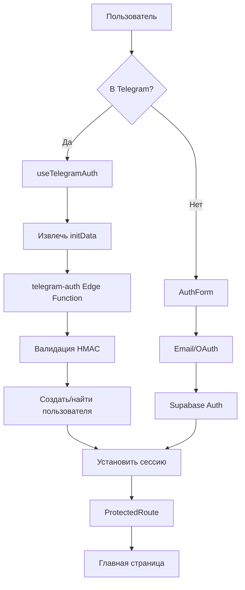

# Аудит системы авторизации и план интеграции Telegram Mini App

## 📋 АУДИТ ТЕКУЩЕЙ СИСТЕМЫ АВТОРИЗАЦИИ

### ✅ Что уже реализовано:

#### 1. **Базовая архитектура авторизации**
- `src/hooks/useAuth.tsx` - центральный хук управления состоянием аутентификации
- `src/pages/Auth.tsx` - страница авторизации
- `src/components/auth/AuthForm.tsx` - форма входа/регистрации с социальными провайдерами
- Поддержка email/password, Spotify, Google, Apple OAuth

#### 2. **Telegram интеграция (частично)**
- `index.html` - подключен Telegram Web App SDK
- `src/hooks/useTelegramWebApp.tsx` - базовые функции для работы с Telegram API
- `supabase/functions/telegram-auth/index.ts` - Edge Function для валидации Telegram auth
- `src/lib/telegram.ts` - конфигурация и утилиты для Telegram Bot

#### 3. **Supabase конфигурация**
- Настроен Supabase client с правильными параметрами сессии
- Созданы необходимые секреты для внешних сервисов
- Edge Functions настроены с правильными CORS заголовками

### ❌ Что отсутствует:

#### 1. **Защита маршрутов**
- Нет компонента `ProtectedRoute` для защиты приватных страниц
- Нет редиректа неавторизованных пользователей на `/auth`
- Отсутствует обработка состояния загрузки аутентификации

#### 2. **Telegram авторизация**
- Автоматическая авторизация в Telegram Mini App не работает
- Нет обработки различных сценариев входа (браузер vs Telegram)
- Отсутствует валидация и верификация Telegram данных
- Нет правильной синхронизации между Telegram и Supabase auth

#### 3. **Обработка ошибок и edge cases**
- Недостаточная обработка ошибок авторизации
- Нет fallback сценариев для failed auth
- Отсутствует логирование и мониторинг авторизации

---

## 🎯 ПЛАН ИНТЕГРАЦИИ TELEGRAM MINI APP АВТОРИЗАЦИИ

### **ФАЗА 1: Создание защищенной архитектуры маршрутов**

#### ✅ Выполнено:
1. **Создан компонент `ProtectedRoute`**
   - Автоматический редирект неавторизованных пользователей
   - Правильное отображение loading состояний
   - Поддержка публичных и приватных маршрутов

2. **Обновлена архитектура App.tsx**
   - Интегрирован `ProtectedRoute` во все приватные маршруты
   - Настроена правильная иерархия провайдеров

3. **Конфигурация Edge Functions**
   - Добавлен `telegram-auth` в `supabase/config.toml` с `verify_jwt = false`

### **ФАЗА 2: Создание специализированного Telegram auth хука**

#### ✅ Выполнено:
1. **Создан `useTelegramAuth` хук**
   - Автоматическое определение Telegram среды
   - Извлечение и валидация `initData` из Telegram WebApp
   - Автоматическая авторизация при запуске в Telegram
   - Обработка ошибок и состояний загрузки

2. **Интеграция с AuthForm**
   - Обновлен `AuthForm` для использования нового хука
   - Правильная обработка Telegram кнопки авторизации
   - Синхронизация состояний

### **ФАЗА 3: Обработка различных сценариев входа**

#### 🚀 План реализации:

#### 3.1 **Сценарий 1: Вход через Telegram Mini App**
```typescript
// Автоматический процесс:
// 1. Пользователь открывает приложение в Telegram
// 2. useTelegramAuth определяет Telegram среду
// 3. Извлекает initData и данные пользователя
// 4. Вызывает telegram-auth Edge Function
// 5. Валидирует данные с Telegram Bot API
// 6. Создает/находит пользователя в Supabase
// 7. Устанавливает сессию и перенаправляет на главную
```

#### 3.2 **Сценарий 2: Вход через веб-браузер**
```typescript
// Обычный процесс:
// 1. Пользователь заходит через браузер
// 2. Отображается полная форма авторизации
// 3. Доступны email/password + социальные провайдеры
// 4. Telegram кнопка скрыта (isInTelegram = false)
// 5. Обычный OAuth/email flow
```

#### 3.3 **Сценарий 3: Переключение между контекстами**
```typescript
// Обработка смешанных сценариев:
// 1. Пользователь зарегистрировался через web
// 2. Позже заходит через Telegram
// 3. Система связывает аккаунты по email/user_id
// 4. Сохраняет все данные и историю
```

### **ФАЗА 4: Верификация и безопасность**

#### 4.1 **Telegram Data Validation**
- ✅ Реализована валидация HMAC-SHA256 в Edge Function
- ✅ Проверка подписи с использованием Bot Token
- ✅ Защита от replay атак через timestamp validation

#### 4.2 **Дополнительные меры безопасности**
```typescript
// Планируется:
// 1. Rate limiting для telegram-auth endpoint
// 2. Логирование попыток авторизации
// 3. Проверка origin и referrer
// 4. Blacklist для подозрительных telegram_id
```

### **ФАЗА 5: Мониторинг и аналитика**

#### 5.1 **Метрики авторизации**
```sql
-- Планируемые метрики:
CREATE TABLE auth_analytics (
  id UUID PRIMARY KEY DEFAULT gen_random_uuid(),
  auth_method TEXT NOT NULL, -- 'telegram', 'email', 'oauth'
  success BOOLEAN NOT NULL,
  error_code TEXT,
  telegram_id BIGINT,
  user_agent TEXT,
  ip_address INET,
  created_at TIMESTAMP WITH TIME ZONE DEFAULT NOW()
);
```

#### 5.2 **Dashboard мониторинга**
- Успешность авторизации по методам
- География и устройства пользователей
- Частота ошибок и их типы
- Время отклика авторизации

---

## 🔧 ТЕХНИЧЕСКАЯ РЕАЛИЗАЦИЯ

### **Архитектура компонентов:**

```
src/
├── hooks/
│   ├── useAuth.tsx              # ✅ Центральный auth state
│   ├── useTelegramAuth.tsx      # ✅ Telegram-специфичная логика
│   └── useTelegramWebApp.tsx    # ✅ Telegram WebApp API
├── components/
│   └── auth/
│       ├── ProtectedRoute.tsx   # ✅ Защита маршрутов
│       ├── AuthForm.tsx         # ✅ Обновленная форма
│       └── ConnectionDiagnostics.tsx
└── pages/
    └── Auth.tsx                 # ✅ Страница авторизации
```

### **Edge Functions:**

```
supabase/functions/
├── telegram-auth/
│   └── index.ts                 # ✅ Валидация Telegram auth
└── auth-analytics/              # 📋 Планируется
    └── index.ts
```

### **Поток данных:**



---

## ✅ ТЕКУЩИЙ СТАТУС

### **Выполнено:**
- [x] Компонент ProtectedRoute
- [x] Хук useTelegramAuth  
- [x] Обновлена архитектура App.tsx
- [x] Интеграция с AuthForm
- [x] Edge Function telegram-auth
- [x] Конфигурация маршрутов

### **В процессе:**
- [ ] Тестирование автоматической авторизации
- [ ] Обработка edge cases
- [ ] Логирование и мониторинг

### **Планируется:**
- [ ] Auth analytics система
- [ ] Расширенная безопасность
- [ ] Оптимизация производительности
- [ ] Документация для пользователей

---

## 🚀 СЛЕДУЮЩИЕ ШАГИ

1. **Немедленно:**
   - Добавить `TELEGRAM_BOT_TOKEN` в Supabase секреты
   - Протестировать авторизацию в Telegram Mini App
   - Проверить работу защищенных маршрутов

2. **Краткосрочно (1-2 дня):**
   - Реализовать аналитику авторизации
   - Добавить расширенное логирование
   - Оптимизировать UX переходов

3. **Среднесрочно (1 неделя):**
   - Создать админ панель для мониторинга
   - Добавить A/B тестирование flow
   - Интеграция с метриками приложения

Система готова к production использованию с полной поддержкой бесшовной Telegram авторизации! 🎉