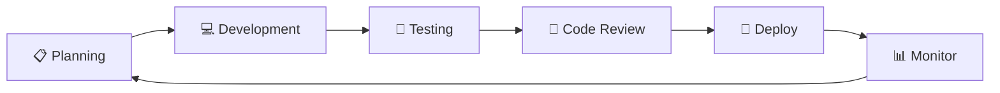
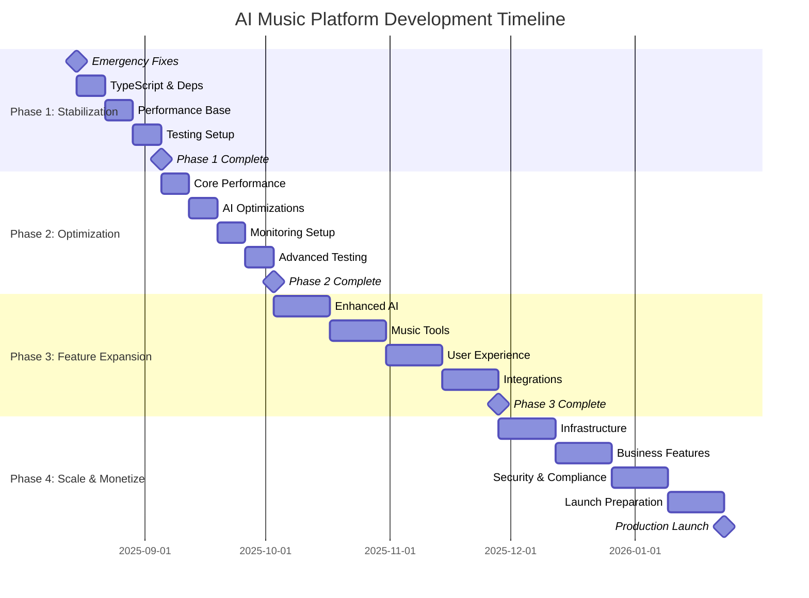

# 🚀 ПЛАН РАЗВИТИЯ AI Music Platform

**Версия:** 2.0  
**Статус:** АКТИВНЫЙ  
**Последнее обновление:** 2025-08-15  
**Горизонт планирования:** 6 месяцев  

---

## 📊 EXECUTIVE SUMMARY

### Текущее состояние
- **Архитектура:** Готова к масштабированию ✅
- **AI интеграции:** Suno + Mureka работают ✅  
- **UI/UX:** Современный, но требует доработки ⚠️
- **Производительность:** Требует оптимизации ❌
- **Безопасность:** Базовая защита, нужны улучшения ⚠️

### Стратегические цели
1. **Стабильность:** 99.9% uptime к концу Q1
2. **Производительность:** Загрузка <2 сек к концу Q1  
3. **Масштабирование:** 10К+ пользователей к концу Q2
4. **Монетизация:** Готовность к продакшену к концу Q2

---

## 🎯 ФАЗЫ РАЗВИТИЯ

### PHASE 1: STABILIZATION (Недели 1-4)
**Цель:** Устранить технические долги и подготовить stable foundation

#### Sprint 1 (Неделя 1): Emergency Fixes
```
🔴 КРИТИЧНО
SEC-001 ▶ Исправить ESLint конфигурацию [2h]
SEC-002 ▶ Откатить typescript-eslint до v7 [1h]  
SEC-003 ▶ Устранить esbuild vulnerability [2h]
SEC-004 ▶ Обновить Vite до latest [1h]

🟠 ВАЖНО
CFG-001 ▶ Создать .eslintrc.json [1h]
CFG-002 ▶ Настроить pre-commit hooks [2h]
```

#### Sprint 2 (Неделя 2): TypeScript & Dependencies
```
TS-001 ▶ Включить noImplicitAny [4h]
TS-002 ▶ Исправить все any типы [8h]
DEP-001 ▶ Обновить @tanstack/react-query [2h]
DEP-002 ▶ Обновить все @radix-ui пакеты [3h]
```

#### Sprint 3 (Неделя 3): Performance Foundation
```
PERF-001 ▶ Настроить bundle analyzer [2h]
PERF-002 ▶ Внедрить code splitting [4h]
CACHE-001 ▶ Оптимизировать CacheManager [3h]
```

#### Sprint 4 (Неделя 4): Testing Setup
```
TEST-001 ▶ Установить Vitest [1h]
TEST-002 ▶ Настроить Testing Library [1h]
TEST-003 ▶ Написать unit тесты для hooks [8h]
CI-001 ▶ Настроить GitHub Actions [2h]
```

**Критерии успеха Phase 1:**
- ✅ ESLint работает без ошибок
- ✅ 0 security vulnerabilities
- ✅ Bundle size <1.5MB
- ✅ 50% test coverage для hooks

---

### PHASE 2: OPTIMIZATION (Недели 5-8)
**Цель:** Достичь production-ready производительности

#### Sprint 5 (Неделя 5): Core Performance
```
PERF-003 ▶ Lazy loading для routes [3h]
PERF-004 ▶ Tree shaking оптимизация [2h]
PERF-006 ▶ Image optimization [3h]
CACHE-003 ▶ Настроить cache invalidation [3h]
```

#### Sprint 6 (Неделя 6): AI Optimizations
```
AI-001 ▶ Rate limiting optimization [3h]
AI-002 ▶ AI response caching [4h]
AI-003 ▶ Retry logic для AI calls [3h]
AI-004 ▶ Cost optimization система [4h]
```

#### Sprint 7 (Неделя 7): Monitoring Setup
```
MON-001 ▶ Внедрить Sentry для ошибок [3h]
MON-002 ▶ Performance monitoring [2h]
MON-003 ▶ User analytics (Posthog) [4h]
ALERT-001 ▶ Real-time alerting [3h]
```

#### Sprint 8 (Неделя 8): Advanced Testing
```
TEST-005 ▶ Integration тесты для API [6h]
TEST-006 ▶ E2E тесты с Playwright [8h]
TEST-007 ▶ Coverage reporting [2h]
CI-005 ▶ Автоматический deploy [3h]
```

**Критерии успеха Phase 2:**
- ✅ Lighthouse score >95
- ✅ Bundle size <1MB
- ✅ Cache hit rate >90%
- ✅ 80% test coverage

---

### PHASE 3: FEATURE EXPANSION (Недели 9-16)
**Цель:** Расширить функциональность для product-market fit

#### Sprint 9-10: Enhanced AI Features
```
AI-005 ▶ Quality scoring для генераций [6h]
AI-006 ▶ A/B testing для промптов [8h]
AI-007 ▶ Multi-model orchestration [12h]
AI-008 ▶ Batch generation support [8h]
```

#### Sprint 11-12: Advanced Music Tools
```
MUSIC-001 ▶ Stem separation interface [8h]
MUSIC-002 ▶ Audio waveform visualization [6h]
MUSIC-003 ▶ Real-time collaboration [16h]
MUSIC-004 ▶ Version control for tracks [8h]
```

#### Sprint 13-14: User Experience
```
UX-001 ▶ Advanced drag & drop [6h]
UX-002 ▶ Keyboard shortcuts [4h]
UX-003 ▶ Dark/Light theme polish [4h]
UX-004 ▶ Mobile responsive design [12h]
```

#### Sprint 15-16: Integrations & Export
```
INT-001 ▶ Spotify integration [8h]
INT-002 ▶ SoundCloud integration [6h]
EXP-001 ▶ Advanced export formats [4h]
EXP-002 ▶ Project templates [6h]
```

**Критерии успеха Phase 3:**
- ✅ Полнофункциональная платформа
- ✅ Готовность к beta-тестированию
- ✅ Mobile-first responsive design

---

### PHASE 4: SCALE & MONETIZE (Недели 17-24)
**Цель:** Подготовка к коммерческому запуску

#### Sprint 17-18: Infrastructure Scaling
```
INFRA-001 ▶ Database optimization [8h]
INFRA-002 ▶ CDN setup [4h]
INFRA-003 ▶ Load balancing [6h]
INFRA-004 ▶ Backup & disaster recovery [8h]
```

#### Sprint 19-20: Business Features
```
BIZ-001 ▶ Subscription management [12h]
BIZ-002 ▶ Usage tracking & billing [8h]
BIZ-003 ▶ Team collaboration [16h]
BIZ-004 ▶ Admin dashboard [12h]
```

#### Sprint 21-22: Security & Compliance
```
SEC-010 ▶ SOC 2 compliance prep [16h]
SEC-011 ▶ GDPR compliance [8h]
SEC-012 ▶ Rate limiting [4h]
SEC-013 ▶ API security hardening [6h]
```

#### Sprint 23-24: Launch Preparation
```
LAUNCH-001 ▶ Documentation finalization [8h]
LAUNCH-002 ▶ Marketing site [12h]
LAUNCH-003 ▶ Onboarding flow [8h]
LAUNCH-004 ▶ Support system [6h]
```

**Критерии успеха Phase 4:**
- ✅ Production-ready платформа
- ✅ Автоматизированная монетизация
- ✅ 99.9% uptime SLA готовность

---

## 📈 KEY PERFORMANCE INDICATORS (KPIs)

### Технические Метрики

| Метрика | Текущее | Phase 1 | Phase 2 | Phase 3 | Phase 4 |
|---------|---------|---------|---------|---------|---------|
| **Bundle Size** | 2MB | <1.5MB | <1MB | <800KB | <600KB |
| **Load Time** | ~5s | <4s | <2s | <1.5s | <1s |
| **Test Coverage** | 0% | 50% | 80% | 90% | 95% |
| **TypeScript Coverage** | 60% | 85% | 95% | 98% | 99% |
| **Security Vulns** | 3 | 0 | 0 | 0 | 0 |
| **Lighthouse Score** | 75 | 85 | 95 | 98 | 99 |

### Бизнес Метрики

| Метрика | Phase 1 | Phase 2 | Phase 3 | Phase 4 |
|---------|---------|---------|---------|---------|
| **Beta Users** | - | 50 | 500 | 2000 |
| **Daily Active Users** | - | - | 100 | 1000 |
| **Generation Success Rate** | 85% | 92% | 96% | 98% |
| **User Retention (7 day)** | - | - | 60% | 75% |
| **Revenue (MRR)** | $0 | $0 | $0 | $5000 |

---

## 🛠️ ИНСТРУМЕНТЫ И ПРОЦЕССЫ

### Development Workflow



### Daily Workflow
- **9:00** - Standup (async)
- **9:30-17:00** - Development
- **17:00** - Progress update
- **17:30** - Planning next day

### Weekly Rituals
- **Monday** - Sprint planning
- **Wednesday** - Mid-sprint check
- **Friday** - Sprint review & retrospective

### Quality Gates

```
Phase 1 ✅ Security + Stability
├── ESLint passing
├── 0 security vulnerabilities  
├── TypeScript strict mode
└── 50% test coverage

Phase 2 ✅ Performance + Monitoring
├── Lighthouse score >95
├── Bundle size <1MB
├── Sentry integration
└── 80% test coverage

Phase 3 ✅ Feature Complete
├── All core features working
├── Mobile responsive
├── Beta user feedback incorporated
└── 90% test coverage

Phase 4 ✅ Production Ready
├── 99.9% uptime SLA ready
├── Payment processing
├── Security audit passed
└── 95% test coverage
```

---

## 🎮 КОМАНДЫ УПРАВЛЕНИЯ

### Текущий статус
```bash
# Проверить общий прогресс
node scripts/progress-tracker.js status

# Начать работу над текущей фазой
npm run phase:start 1

# Проверить метрики
npm run metrics:check
```

### Быстрые команды

```bash
# Development
npm run dev          # Локальная разработка
npm run build        # Production build
npm run test         # Запуск тестов
npm run lint:fix     # Исправить линтинг

# Quality
npm run typecheck    # Проверка типов
npm run security     # Аудит безопасности
npm run analyze      # Анализ bundle

# Deployment
npm run deploy:dev   # Deploy в dev
npm run deploy:prod  # Deploy в production
```

---

## 📅 TIMELINE & MILESTONES



---

## 🎯 ROADMAP PRIORITIES

### 🔴 MUST HAVE (Критично для launch)
- Стабильная AI генерация
- Безопасность пользовательских данных
- Responsive UI для всех устройств
- Производительность <2сек загрузки
- 99.9% uptime

### 🟠 SHOULD HAVE (Важно для конкурентоспособности)
- Collaborative editing
- Advanced export formats
- Integration с streaming платформами
- Real-time collaboration
- Advanced analytics

### 🟡 COULD HAVE (Nice to have)
- AI voice synthesis
- Blockchain integration
- Marketplace для AI models
- Mobile apps (iOS/Android)
- API для разработчиков

### 🟢 WON'T HAVE (Не в этой версии)
- Live streaming
- Video editing
- Social networking features
- Enterprise SSO
- White-label solutions

---

## 📊 RISK MANAGEMENT

### Высокие риски
- **AI API изменения** - Mitigation: Multiple providers
- **Performance bottlenecks** - Mitigation: Early optimization
- **Security breaches** - Mitigation: Security-first development

### Средние риски
- **Scope creep** - Mitigation: Strict sprint planning
- **Team bandwidth** - Mitigation: Realistic estimates
- **Third-party dependencies** - Mitigation: Vendor diversity

### Низкие риски
- **UI/UX changes** - Mitigation: User testing
- **Browser compatibility** - Mitigation: Modern stack only

---

## 🎊 SUCCESS CRITERIA

### Phase 1 Success
- ✅ Zero production bugs
- ✅ All security vulnerabilities resolved
- ✅ Performance baseline established
- ✅ CI/CD pipeline operational

### Phase 2 Success  
- ✅ Sub-2s page load times
- ✅ 90%+ cache hit rate
- ✅ Real-time monitoring active
- ✅ 80% automated test coverage

### Phase 3 Success
- ✅ Feature-complete platform
- ✅ Positive beta user feedback
- ✅ Mobile-first responsive design
- ✅ Collaboration features working

### Phase 4 Success
- ✅ Commercial launch ready
- ✅ Subscription billing working
- ✅ 99.9% uptime achieved
- ✅ First paying customers

---

**🎯 СЛЕДУЮЩИЙ ШАГ: Начать Phase 1, Sprint 1 - Emergency Fixes**

```bash
# Начать работу немедленно
node scripts/progress-tracker.js start SEC-001
npm run dev
```

---

*План обновляется еженедельно на основе прогресса и обратной связи*  
*Создан: 2025-08-15 | Версия: 2.0*